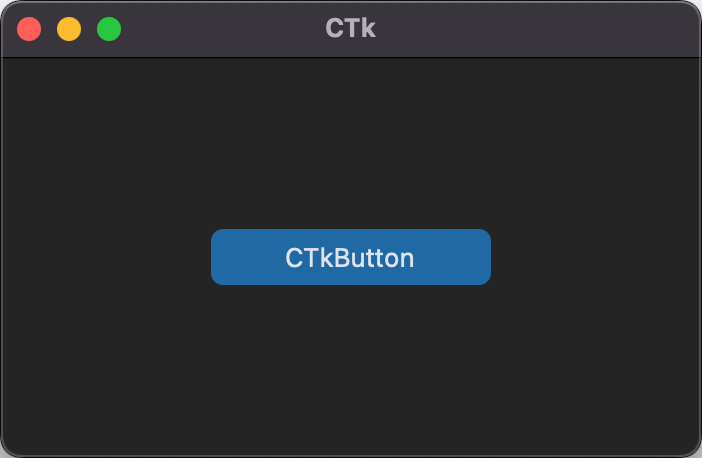
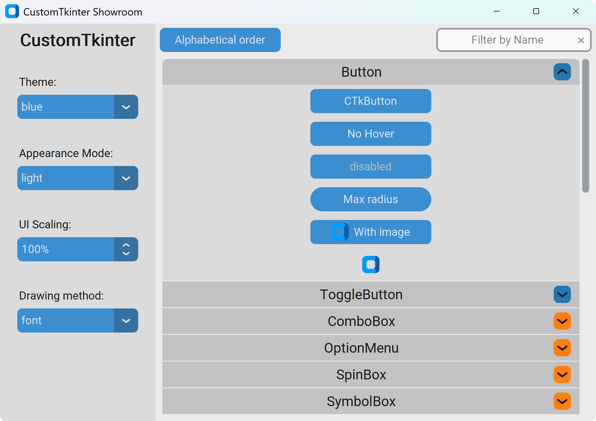

Quickstart
==========

Installation
------------

Install the module with pip_:

::

   pip install custom2kinter

Usage
-----

.. code:: python

   import customtkinter as ctk

.. attention::
   This Library is still imported using the original name: "custom\ **t**\ kinter".

Example Program
---------------

To test ``custom2kinter`` you can try this simple example with only a single button:

.. code:: python

   import customtkinter as ctk

   ctk.set_appearance_mode("system")
   ctk.set_default_color_theme("blue")

   # Create CTk window like you do with the Tk window
   app = ctk.CTk()
   app.geometry("400x240")

   def button_callback() -> None:
       print("button pressed")

   # Use CTkButton instead of tkinter.Button
   button = ctk.CTkButton(master=app, text="CTkButton", command=button_callback)
   button.place(relx=0.5, rely=0.5, anchor=ctk.CENTER)

   app.mainloop()

which results in the following window on macOS:

.. _showroom_app:

Showroom
--------

You can run the following code to show a simple App that displays all available widgets:

.. code:: python

   from customtkinter.showroom import run_showroom
   run_showroom()

.. _pip: https://pypi.org/project/custom2kinter/
