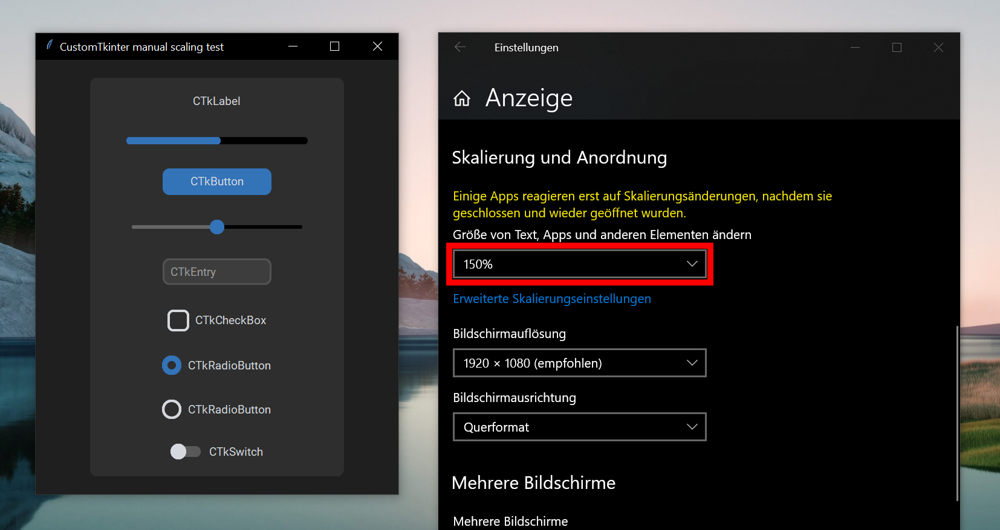

Scaling
=======

HighDPI support
---------------

CustomTkinter supports HighDPI scaling on macOS and Windows by default.
On macOS scaling works automatically for Tk windows.
On Windows, the app is made DPI aware (``windll.shcore.SetProcessDpiAwareness(2)``)
and the current scaling factor of the display is detected.

| **Every** dimension for any widget and window is scaled according to this factor.
| Affected arguments have "unscaled pixels" as unit of measurement.

.. note::
   You can deactivate this automatic scaling by invoking this function before
   instantiating any App:

   .. code:: python

      ctk.deactivate_automatic_dpi_awareness()

   Then the App will be blurry on Windows with a scaling value of more than 100%.

Custom scaling
--------------

In addition to the automatically detected scaling factor, you can also set your own
scaling factors for the application to zoom in/out all widgets at once:

.. code:: python

   ctk.set_widget_scaling(float_value)  # widget dimensions and text size
   ctk.set_window_scaling(float_value)  # window geometry dimensions
