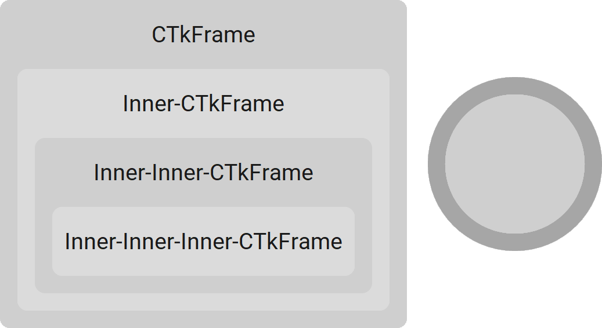

CTkFrame
========

The ``CTkFrame`` widget is a rounded rectangular container used to
group related widgets and organize an application's layout.

Use it to create panels, form sections, reusable components,
or custom widget classes.

Example Code
------------

.. tab-set::

   .. tab-item:: Functional approach

      .. code:: python

         frame = ctk.CTkFrame(app)

         def button_callback() -> None:
             print("button click")

         # add widgets to frame
         button = ctk.CTkButton(frame, command=button_callback)
         button.pack()

   .. tab-item:: OOP approach

      .. code:: python

         class CustomFrame(ctk.CTkFrame):
             def __init__(self, master: ctk.CTkContainer, **kwargs) -> None:
                 super().__init__(master, **kwargs)

                 # add widgets to frame
                 self.button = ctk.CTkButton(self, command=self.button_callback)
                 self.button.pack()

             def button_callback(self) -> None:
                 print("button click")

         # instantiate the frame
         frame = CustomFrame(app)

.. py:class:: CTkFrame
   :hidden:

   Arguments
   ---------

   Positional
   ~~~~~~~~~~

   .. include:: /arguments/master.rst
   .. include:: /arguments/theme_key.rst

   Functionality
   ~~~~~~~~~~~~~

   .. include:: /arguments/background_corner_colors.rst

   Themed
   ~~~~~~

   .. include:: /arguments/widtheight_container.rst
   .. include:: /arguments/corner_radius.rst
   .. include:: /arguments/border_width.rst
   .. include:: /arguments/bg_color.rst
   .. include:: /arguments/fg_color.rst
   .. include:: /arguments/top_fg_color.rst
   .. include:: /arguments/border_color.rst

   Methods
   -------

   Inherited
   ~~~~~~~~~

   .. include:: /methods/container.rst
   .. include:: /methods/widget.rst
   .. include:: /methods/geometry_manager.rst
