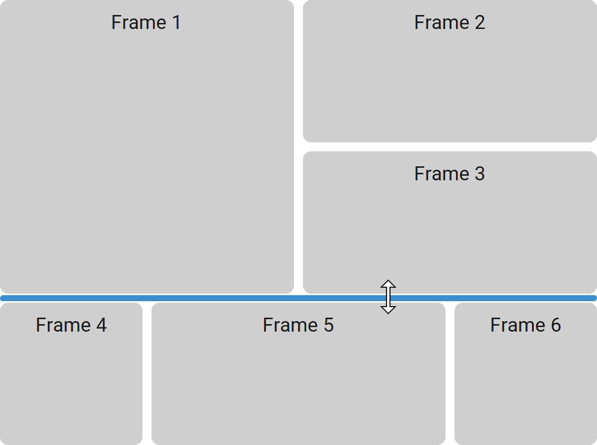

CTkGridView
===========

The ``CTkGridView`` widget provides a resizable grid of frames
separated by draggable row and column dividers.

You can configure any number of frames, but display just a few at a time.
It is the foundation of all modern applications with many sections that can be
moved around (the main example is VS Code itself).

Use it for dashboards, split panes, or layouts where the user should be able
to adjust the relative size of rows and columns at runtime.

If you don't want users to resize rows and columns, use :doc:`/containers/CTkFrame`
with Tkinter's grid geometry manager instead.

.. note::
   The attributes :py:attr:`corner_radius`, :py:attr:`border_width`, :py:attr:`fg_color`,
   :py:attr:`top_fg_color`, and :py:attr:`border_color` are used to create the
   :doc:`CTkFrames </containers/CTkFrame>` contained in this widget.
   By itself, this widget has a ``"transparent"`` foreground color, with no border.

Example Code
------------

.. code:: python

   gridview = ctk.CTkGridView(app)

   # create frames
   frame1 = gridview.insert("Frame 1", 0, 0, 2, 1)
   frame2 = gridview.insert("Frame 2", 1, 0)
   frame3 = gridview.insert("Frame 3")  #remains hidden for now

   # add existing frame
   my_frame = ctk.CTkFrame(gridview)
   gridview.insert("MyFrame", 1, 1, frame=my_frame)

.. py:class:: CTkGridView
   :hidden:

   Arguments
   ---------

   Positional
   ~~~~~~~~~~

   .. include:: /arguments/master.rst
   .. include:: /arguments/theme_key.rst

   Functionality
   ~~~~~~~~~~~~~

   .. include:: /arguments/state.rst

   .. py:attribute:: min_rows_size
      :type: float
      :value: 0.05

      Minimal rows dimension as a percentage of the overall height of the widget.

      .. hint::
         Set it to ``0.0`` to allow the user to close a row completely.

   .. py:attribute:: min_columns_size
      :type: float
      :value: 0.05

      Minimal columns dimension as a percentage of the overall width of the widget.

      .. hint::
         Set it to ``0.0`` to allow the user to close a column completely.

   .. py:attribute:: pre_command
      :type: ((int | None, int| None) -> ('break' | None)) | None
      :value: None

      Function that is invoked when the user clicks on a row/column separator,
      but **before** the widget starts resizing them.
      It receives the indexes of the row and column that will be resized
      (in this order, and one can be ``None``).

      If the function returns exactly ``"break"``, the operation is interrupted
      and :py:attr:`command` is never invoked.

   .. py:attribute:: command
      :type: ((int | None, int| None) -> None) | None
      :value: None

      Function that is invoked **periodically** when the user has clicked on a row/column separator
      and is dragging it to change the size of a row and/or column.
      It receives the indexes of the row and column that are being resized
      (in this order and one can be ``None``).

      If the function specified by :py:attr:`pre_command` returned ``"break"``,
      this function is never invoked.

   Themed
   ~~~~~~

   .. include:: /arguments/widtheight.rst

   .. py:attribute:: thickness
      :type: int

      Thickness of the separators between rows and columns in |unscaled pixels|.

   .. include:: /arguments/corner_radius.rst
   .. include:: /arguments/border_width.rst
   .. include:: /arguments/bg_color.rst
   .. include:: /arguments/fg_color.rst
   .. include:: /arguments/top_fg_color.rst
   .. include:: /arguments/border_color.rst
   .. include:: /arguments/border_spacing.rst

   .. py:attribute:: hover_color
      :type: str | tuple[str, str]

      Color of separators between rows and columns when the user hovers over them with the mouse.

   .. include:: /arguments/hover.rst

   Class attributes
   ~~~~~~~~~~~~~~~~

   |class_attributes_description|

   .. py:attribute:: update_time
      :type: int

      Refresh rate of the drag animation, expressed in milliseconds.

      .. hint::
         |update_time_hint|

   .. py:attribute:: hover_delay
      :type: int

      Time that is waited before applying the :py:attr:`hover_color` while
      the mouse is hovering over a separator, expressed in milliseconds.

      .. note::
         It has been noticed that while moving the mouse over this widget, the color
         kept flashing on and off, which was annoying.
         With this parameter, we wait to confirm that the mouse is over the
         separator because the user is about to drag it.

   .. py:attribute:: min_size_limit
      :type: float

      Minimum size of each row/column, a percentage of the overall available space.

      .. hint::
         Set it to ``0.0`` to allow the user to collapse a row/column completely.

   .. py:attribute:: base_weight
      :type: int

      Controls the granularity of possible row and column dimensions.

   Methods
   -------

   .. py:method:: insert(name[, row, column][, rowspan][, columnspan][, frame]) -> CTkFrame:

      Creates a new frame with the given ``name`` and returns it.

      You can also provide an already instantiated ``frame`` that has this widget as master.

      If the other parameters are provided, the new frame is placed at that position using :py:meth:`show()`.

      :param str name:
         Key name you will have to use to refer to the new frame when using other methods.

      :type row: int | None
      :param row:
         Row in which the new frame will be placed.

         If omitted, the frame is created but remains hidden. You can show it later with :py:meth:`show()`.

      :type column: int | None
      :param column:
         Column in which the new frame will be placed.

         If omitted, the frame is created but remains hidden. You can show it later with :py:meth:`show()`.

      :param int rowspan:
         Number of rows that will be occupied by the frame (default is ``1``), starting from ``row``.

      :param int columnspan:
         Number of columns that will be occupied by the frame (default is ``1``), starting from ``column``.

      :type frame: CTkFrame | None
      :param frame:
         An already existing :doc:`/containers/CTkFrame`, child of this widget, to be added to the managed frames.

         If omitted, a new frame is created.

      :returns:
         A newly created :doc:`/containers/CTkFrame` or ``frame``, on which you can map any widget.

      :raises ValueError:
         If ``name`` is already assigned to another frame.

      :raises RuntimeError:
         If ``frame`` is not a child of this widget.

   .. py:method:: delete(name[, preserve_weights]) -> None:

      Deletes the frame with the given ``name``.

      |preserve_weights_description|

      :param str name:
         Name of the frame to be deleted.

      :param bool preserve_weights:
         |preserve_weights_param|

      :raises ValueError:
         If ``name`` is not found.

   .. py:method:: show(name, row, column[, rowspan][, columnspan]) -> None:

      Shows a hidden frame with the given ``name`` and places it at the provided position.

      :param str name:
         Name of the frame to be shown.

      :param int row:
         Row in which the frame will be placed.

      :param int column:
         Column in which the frame will be placed.

      :param int rowspan:
         Number of rows that will be occupied by the frame (default is ``1``), starting from ``row``.

      :param int columnspan:
         Number of columns that will be occupied by the frame (default is ``1``), starting from ``column``.

      :raises ValueError:
         If ``name`` is not found.

   .. py:method:: hide(name[, preserve_weights]) -> None:

      | Hides the frame with the given ``name``.
      | It is NOT deleted: it can be displayed again with :py:meth:`show()`.

      |preserve_weights_description|

      :param str name:
         Name of the frame to hide.

      :param bool preserve_weights:
         |preserve_weights_param|

      :raises ValueError:
         If ``name`` is not found.

   .. py:method:: frame(name) -> CTkFrame:

      Returns the :doc:`/containers/CTkFrame` object with the provided ``name``.

      :param str name:
         Name of the frame to return.

      :returns:
         The :doc:`/containers/CTkFrame` named ``name``.

      :raises ValueError:
         If ``name`` is not found.

   .. py:method:: get(what) -> list[float]:

      Returns the size of all rows/columns as percentage of the overall height/width.

      The sum of the values in the returned list is guaranteed to be ``1.0``.

      :type what: 'rows' | 'columns'
      :param what:
         Allows choosing the dimensions to be returned.

      :returns:
         A list containing the size of rows/columns as percentage values.

      :raises ValueError:
         If ``what`` has an unknown value.

   .. py:method:: set([row_sizes][, column_sizes]) -> None:

      Sets all row and/or column sizes to the provided values, regardless of the widget's state.

      The values represent percentages of the overall height/width.
      If the sum is not ``1.0``, the values will be rescaled accordingly.

      If you provide fewer values than needed, the mean value will be used for additional rows/columns.

      :type row_sizes: list[float] | None
      :param row_sizes:
         Sizes to be used for the rows.

         Do not provide this parameter or set it to ``None`` if you want to preserve the current row sizes.

      :type column_sizes: list[float] | None
      :param column_sizes:
         Sizes to be used for the columns.

         Do not provide this parameter or set it to ``None`` if you want to preserve the current column sizes.

   Inherited
   ~~~~~~~~~

   .. include:: /methods/container.rst
   .. include:: /methods/widget.rst
   .. include:: /methods/geometry_manager.rst

   .. |preserve_weights_description| replace::
      If ``preserve_weights`` is ``False`` (the default), in case the last row/column becomes empty,
      it will be removed by redistributing the space to the other columns.
      If instead it is ``True``, the size of all rows/columns won't change in any case.

   .. |preserve_weights_param| replace::
      Whether to change the rows/columns size if the last one becomes empty.
