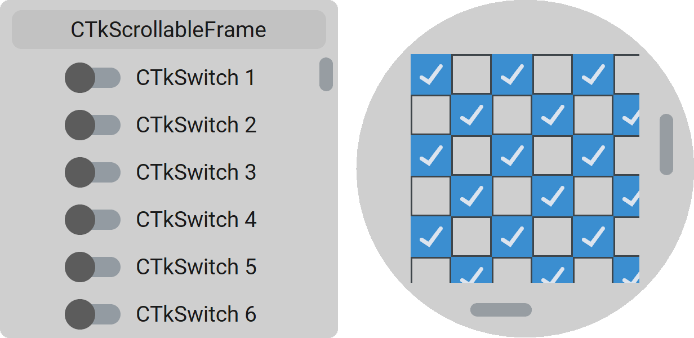

CTkScrollableFrame
==================

The ``CTkScrollableFrame`` widget is a frame with built-in scrolling
(vertically and/or horizontally) for child widgets.

Use it when a panel or form can contain more content than fits in its available
height or width while keeping the child widgets arranged like a normal frame.

Example Code
------------

.. tab-set::

   .. tab-item:: Functional approach

      .. code:: python

         frame = ctk.CTkScrollableFrame(app)

         def button_callback() -> None:
             print("button click")

         # add widgets to frame
         button = ctk.CTkButton(frame, command=button_callback)
         button.pack()

   .. tab-item:: OOP approach

      .. code:: python

         class CustomFrame(ctk.CTkScrollableFrame):
             def __init__(self, master: ctk.CTkContainer, **kwargs) -> None:
                 super().__init__(master, **kwargs)

                 # add widgets to frame
                 self.button = ctk.CTkButton(self, command=self.button_callback)
                 self.button.pack()

             def button_callback(self) -> None:
                 print("button click")

         # instantiate the frame
         frame = CustomFrame(app)

More examples can be found in a :examples:`dedicated folder <scrollable_frame>` on GitHub.

.. py:class:: CTkScrollableFrame
   :hidden:

   Arguments
   ---------

   Positional
   ~~~~~~~~~~

   .. include:: /arguments/master.rst
   .. include:: /arguments/theme_key.rst

   Functionality
   ~~~~~~~~~~~~~

   .. py:attribute:: scrollable_width
      :type: int
      :value: 0
   .. py:attribute:: scrollable_height
      :type: int
      :value: 0

      If you want to use ``place()`` geometry manager to display widgets in this frame,
      you have to provide the size of the overall canvas that will be scrolled.

      If instead you use ``pack()`` or ``grid()``, the area expands automatically to show
      all child widgets, and these arguments are ignored.

   .. py:attribute:: xscrollincrement
      :type: int
      :value: 25

      Number of |unscaled pixels| by which the visible widgets are moved
      every time the user scrolls on the widget horizontally.

   .. py:attribute:: yscrollincrement
      :type: int
      :value: 25

      Number of |unscaled pixels| by which the visible widgets are moved
      every time the user scrolls on the widget vertically.

   Themed
   ~~~~~~

   .. include:: /arguments/widtheight.rst
   .. include:: /arguments/corner_radius.rst
   .. include:: /arguments/border_width.rst
   .. include:: /arguments/bg_color.rst
   .. include:: /arguments/fg_color.rst
   .. include:: /arguments/top_fg_color.rst
   .. include:: /arguments/border_color.rst
   .. include:: /arguments/border_spacing.rst

   .. py:attribute:: orientation
      :type: 'horizontal' | 'vertical' | 'both'
      :value: 'vertical'

      Defines in which directions the widget can be scrolled and, consequently,
      which :doc:`/widgets/CTkScrollbar` will be shown.

   .. include:: /arguments/fit_content.rst
   .. include:: /arguments/show_scrollbars.rst
   .. include:: /arguments/scrollbar.rst
   .. include:: /arguments/label.rst

   Class attributes
   ~~~~~~~~~~~~~~~~

   |class_attributes_description|

   .. include:: /arguments/scrollbar_update_time.rst

   Methods
   -------

   .. include:: /methods/scrollableframe.rst

   Inherited
   ~~~~~~~~~

   .. include:: /methods/container.rst
   .. include:: /methods/widget.rst
   .. include:: /methods/geometry_manager.rst
