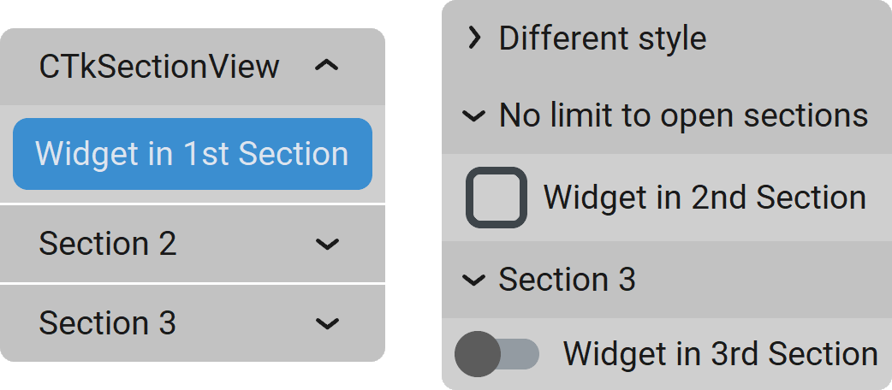

CTkSectionView
==============

The ``CTkSectionView`` widget organizes content into collapsible frames with headers
that the user can open or close.

It can be placed in a :doc:`/containers/CTkScrollableFrame`, allowing the user to open multiple
sections and still see them all by scrolling.

Use it for dense forms, settings, or explanatory content where grouping information
into expandable sections helps keep the interface compact.

An alternative widget is :doc:`/containers/CTkTabview`, which is more suitable when you have more
space and the sections have the same dimensions.

Example Code
------------

.. code:: python

   sectionview = ctk.CTkSectionView(app)

   # create frames
   frame1 = sectionview.add("Section 1")
   frame2 = sectionview.add("Section 2")
   frame3 = sectionview.insert("Section 3")  #remains hidden for now

   # customize the components of a specific section
   sectionview.header("Section 1").configure(...)
   sectionview.section("Section 1").configure(...)
   sectionview.symbol("Section 1").configure(...)

.. py:class:: CTkSectionView
   :hidden:

   Arguments
   ---------

   Positional
   ~~~~~~~~~~

   .. include:: /arguments/master.rst
   .. include:: /arguments/theme_key.rst

   Functionality
   ~~~~~~~~~~~~~

   .. include:: /arguments/state.rst

   .. py:attribute:: max_open
      :type: int
      :value: 1

      | Maximum number of open sections.
      | If the user opens an additional one, the oldest open section gets closed.

      .. hint::
         Set it to ``0`` to have no limit.

   .. py:attribute:: pre_command
      :type: ((str) -> ('break' | None)) | None
      :value: None

      Function that is invoked when the user clicks on a section header,
      but **before** the widget opens or closes it.
      It receives the name of the clicked section as its only parameter.

      If the function returns exactly ``"break"``, the operation is not performed
      and :py:attr:`command` is not invoked at all.

   .. py:attribute:: command
      :type: ((str) -> None) | None
      :value: None

      Function that is invoked when the user clicks on a section header,
      but **after** the widget has opened or closed it.
      It receives the name of the clicked section as its only parameter.

      If the function specified by :py:attr:`pre_command` returned ``"break"``,
      this function is not invoked.

   Themed
   ~~~~~~

   .. include:: /arguments/widtheight_container.rst
   .. include:: /arguments/corner_radius.rst
   .. include:: /arguments/border_spacing.rst

   .. py:attribute:: internal_spacing
      :type: int

      Space in |unscaled pixels| between sections.

      .. note::
         If there is just one section, this argument has no effect.

   .. include:: /arguments/bg_color.rst

   .. py:attribute:: fg_color_header
      :type: str | tuple[str, str] | 'transparent'

      Main color of the header of each section.

   .. include:: /arguments/fg_color.rst
   .. include:: /arguments/top_fg_color.rst

   .. py:attribute:: hover_color
      :type: str | tuple[str, str]

      Main color of the section header when the user hovers over it with the mouse.

   .. include:: /arguments/hover.rst

   .. py:attribute:: open_symbol
      :type: SymbolType
      :value: 'v'

      | Symbol that is displayed in the section header when it is closed.
      | When clicked, the section will open.

   .. py:attribute:: close_symbol
      :type: SymbolType
      :value: '^'

      | Symbol that is displayed in the section header when it is open.
      | When clicked, the section will close.

   .. include:: /arguments/symbolbox.rst

   Methods
   -------

   .. py:method:: get(index | what) -> str | list[str]:

      Returns the names of all/visible/open sections, in the order of creation/display/opening.

      If ``index`` is provided, returns the section name at that position.

      :type index: int | None
      :param index:
         Position of the section whose name is to be returned.

         Don't provide this parameter or set it to ``None`` to retrieve the sections based on ``what``.

      :type what: 'all' | 'visible' | 'open'
      :param what:
         Allows specifing what type of sections should be returned.

      :returns:
         A single name if ``index`` is provided; otherwise, a list of section names.

      :raises IndexError:
         If ``index`` is invalid.

      :raises ValueError:
         If ``what`` has an unknown value.

   .. py:method:: set([visible_sections][, open_sections]) -> None:

      Allows changing visible and/or open sections and their positions,
      regardless of the widget's :py:attr:`state` and :py:attr:`max_open` limit.

      |no_callbacks|

      :type visible_sections: list[str] | None
      :param visible_sections:
         List of section names to be shown in the provided order.

         Don't provide this parameter or set it to ``None`` to preserve the current visible sections.

      :type open_sections: list[str] | None
      :param open_sections:
         | List of section names to be open.
         | The first section in the list will be the first to be closed due to :py:attr:`max_open`.

         Don't provide this parameter or set it to ``None`` to preserve the current open sections.

   .. py:method:: insert(name[, index]) -> CTkFrame:

      Creates a new section with the given ``name`` and returns its main :doc:`/containers/CTkFrame`.

      If ``index`` is provided, the new section is placed at that position using :py:meth:`show()`.

      :param str name:
         Key name you will have to use to refer to the new section when using other methods.

      :type index: int | None
      :param index:
         Position at which the new section will be placed.

         If omitted, the section is created but remains hidden.
         You can show it later with :py:meth:`show()` or :py:meth:`set()`.

      :raises ValueError:
         If ``name`` is already assigned to another section.

   .. py:method:: add(name) -> CTkFrame:

      Creates a new section with the given ``name``, places it at the end,
      and returns its main :doc:`/containers/CTkFrame`.

      :param str name:
         Key name you will have to use to refer to the new section when using other methods.

      :raises ValueError:
         If ``name`` is already assigned to another section.

   .. py:method:: delete(name) -> None:

      Deletes the section with the given ``name``.

      :param str name:
         Name of the section to be deleted.

      :raises ValueError:
         If ``name`` is not found.

   .. py:method:: show(name[, index]) -> None:

      Shows a hidden section with the given ``name`` and places it at the provided position.

      .. note::
         If the section is already visible, this method has no effect: use :py:meth:`move()` instead.

      :param str name:
         Name of the section to be shown.

      :type index: int | None
      :param index:
         Position at which the section will be placed.

         If omitted, the section will be placed at the end.

      :raises ValueError:
         If ``name`` is not found.

         If ``index`` is an invalid index.

   .. py:method:: hide(name) -> None:

      | Hides the section with the given ``name``.
      | It is NOT deleted: it can be displayed again with :py:meth:`show()` or :py:meth:`set()`.

      :param str name:
         Name of the section to hide.

      :raises ValueError:
         If ``name`` is not found.

   .. py:method:: move(new_index, name) -> None:

      Moves the section with the given ``name`` at the position provided with ``new_index``.

      If the section is hidden, it's like using :py:meth:`show()`.

      :param int new_index:
         Position at which the section will be placed.

      :param str name:
         Name of the section to be moved.

      :raises ValueError:
         If ``name`` is not found.

         If ``new_index`` is an invalid index.

   .. py:method:: open(name) -> None:

      Opens the section with the given ``name``.

      :param str name:
         Name of the section to be opened.

      :raises ValueError:
         If ``name`` is not found.

   .. py:method:: close(name) -> None:

      Closes the section with the given ``name``.

      :param str name:
         Name of the section to be closed.

      :raises ValueError:
         If ``name`` is not found.

   .. py:method:: invoke(name) -> None:

      Toggles the open/close status of the section with the given ``name``
      if the widget's :py:attr:`state` is not ``"disabled"``
      and the :py:attr:`pre_command` doesn't return ``"break"``.

      It can be called to simulate the user who clicks on a specific header.

      :param str name:
         Name of the section to change its open/close status.

      :raises ValueError:
         If ``name`` is not found.

   .. py:method:: index([name]) -> int | list[int]:

      Returns the index of all **open** sections.

      If ``name`` is provided, returns its index instead.

      :type name: str | None
      :param name:
         Section you want to know the index of.

         Don't provide this parameter or set it to ``None`` to retrieve the index of all open sections.

      :returns:
         A single index if ``name`` is provided, or a list of indexes of all open sections.

      :raises ValueError:
         If ``name`` is not found.

   .. py:method:: len(what) -> int:

      Returns the number of all/visible/open sections.

      :type what: 'all' | 'visible' | 'open'
      :param what:
         Allows specifing what type of sections should be considered.

      :returns:
         The number of all/visible/open sections.

      :raises ValueError:
         If ``what`` has an unknown value.

   .. py:method:: section(name) -> CTkFrame:

      Returns the main :doc:`/containers/CTkFrame` object for the section with the provided ``name``.

      :param str name:
         Name of the section whose main frame is to be returned.

      :returns:
         The main :doc:`/containers/CTkFrame` of the section named ``name``.

      :raises ValueError:
         If ``name`` is not found.

   .. py:method:: header(name) -> CTkFrame:

      Returns the header :doc:`/containers/CTkFrame` object for the section with the provided ``name``.

      It can be used to further customize each header individually,
      for example, to change the main color or add additional widgets.

      :param str name:
         Name of the section whose header is to be returned.

      :returns:
         The header :doc:`/containers/CTkFrame` of the section named ``name``.

      :raises ValueError:
         If ``name`` is not found.

   .. py:method:: symbol(name) -> CTkSymbolBox:

      Returns the :doc:`/widgets/CTkSymbolBox` object for the section with the provided ``name``.

      It can be used to further customize each object individually,
      for example, to change the button color or the displayed text.

      :param str name:
         Name of the section whose ``CTkSymbolBox`` is to be returned.

      :returns:
         The :doc:`/widgets/CTkSymbolBox` of the section named ``name``.

      :raises ValueError:
         If ``name`` is not found.

   Inherited
   ~~~~~~~~~

   .. include:: /methods/container.rst
   .. include:: /methods/widget.rst
   .. include:: /methods/geometry_manager.rst
