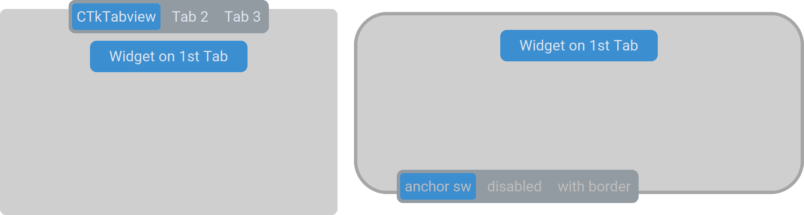

CTkTabview
==========

The ``CTkTabview`` creates a tabbed container, similar to a Tkinter notebook.

Use it to divide related but distinct views into named tabs while keeping
them in the same application window.

An alternative widget is :doc:`/containers/CTkSectionView`, which is more suitable
when you have less space or the user has to see multiple frames at the same time.

Example Code
------------

.. code:: python

   tabview = ctk.CTkTabview(app)

   # create frames
   frame1 = tabview.add("Tab 1")
   frame2 = tabview.add("Tab 2")
   frame3 = tabview.add("Tab 3")

   # customize the components of a specific tab
   tabview.tab("Tab 1").configure(...)
   tabview.button("Tab 1").configure(...)

.. py:class:: CTkTabview
   :hidden:

   Arguments
   ---------

   Positional
   ~~~~~~~~~~

   .. include:: /arguments/master.rst
   .. include:: /arguments/theme_key.rst

   Functionality
   ~~~~~~~~~~~~~

   .. include:: /arguments/state.rst

   .. py:attribute:: pre_command
      :type: ((str) -> ('break' | None)) | None
      :value: None

      Function that is invoked when the user selects a new tab,
      but **before** the widget actually shows it.
      It receives the selected tab name as its only parameter.

      If the function returns exactly ``"break"``, the operation is not performed
      and :py:attr:`command` is not invoked at all.

   .. py:attribute:: command
      :type: ((str) -> None) | None
      :value: None

      Function that is invoked when the user selects a new tab,
      but **after** the widget has shown it.
      It receives the selected tab name as its only parameter.

      If the function specified by :py:attr:`pre_command` returned ``"break"``,
      this function is not invoked.

   Themed
   ~~~~~~

   .. include:: /arguments/widtheight_container.rst
   .. include:: /arguments/corner_radius.rst
   .. include:: /arguments/border_width.rst
   .. include:: /arguments/bg_color.rst
   .. include:: /arguments/fg_color.rst
   .. include:: /arguments/top_fg_color.rst
   .. include:: /arguments/border_color.rst

   .. py:attribute:: anchor
      :type: 'center' | 'n' | 'ne' | 'e' | 'se' | 's' | 'sw' | 'w' | 'nw'
      :value: 'center'

      It controls where the :doc:`/widgets/CTkSegmentedButton` nested widget is positioned.

      ``"center"`` (like ``"n"``) places it at the top, in the middle;
      ``"ne"`` places it in the top-right corner,
      and ``"sw"`` positions it in the bottom-left corner.

   .. include:: /arguments/segmented_button.rst

   Class attributes
   ~~~~~~~~~~~~~~~~

   |class_attributes_description|

   .. py:attribute:: outer_button_overhang
      :type: int

      Amount of |unscaled pixels| by which the :doc:`/widgets/CTkSegmentedButton`
      protrudes from the main area.

   .. py:attribute:: extra_button_border
      :type: int

      Additional space in |unscaled pixels| between the end of the rounded corner and
      the :doc:`/widgets/CTkSegmentedButton` widget.

      .. note::
         Its effects are more evident when :py:attr:`anchor` contains ``"e"`` or ``"w"``

   Methods
   -------

   .. py:method:: get([index]) -> str:

      Returns the name of the visible tab.

      If ``index`` is provided, returns the tab name at that position.

      :type index: int | None
      :param index:
         Position of the tab whose name is to be returned.

         Don't provide this parameter or set it to ``None`` to retrieve the name of the active tab.

      :returns:
         Name of the tab currently visible or the tab name at the provided position.

      :raises IndexError:
         If ``index`` is invalid.

   .. py:method:: set(name) -> None:

      Changes the visible tab to the provided one,
      regardless of the widget's :py:attr:`state` and admissible names.

      |no_callbacks|

      :param str name:
         Name of the tab to be shown.

      :raises ValueError:
         If ``name`` is not found.

   .. py:method:: invoke(name) -> None:

      Shows the tab with the given ``name``
      if the :py:attr:`pre_command` doesn't return ``"break"``.

      It can be called to simulate the user who clicks on a specific button.

      :param str name:
         Name of the tab to be shown.

      :raises ValueError:
         If ``name`` is not found.

   .. py:method:: insert(index, name) -> CTkFrame:

      Creates a new tab with the given ``name``, places it at the provided position,
      and returns its main :doc:`/containers/CTkFrame`.

      :param int index:
         Position at which the new tab will be placed.

      :param str name:
         Key name you will have to use to refer to the new tab when using other methods
         and that will be displayed in the :doc:`/widgets/CTkSegmentedButton` for the user to click.

      :raises ValueError:
         If ``name`` is already assigned to another tab.

   .. py:method:: add(name) -> CTkFrame:

      Creates a new tab with the given ``name``, places it at the end,
      and returns its main :doc:`/containers/CTkFrame`.

      :param str name:
         Key name you will have to use to refer to the new tab when using other methods
         and that will be displayed in the :doc:`/widgets/CTkSegmentedButton` for the user to click.

      :raises ValueError:
         If ``name`` is already assigned to another tab.

   .. py:method:: delete(name) -> None:

      Deletes the tab with the given ``name``.

      :param str name:
         Name of the tab to be deleted.

      :raises ValueError:
         If ``name`` is not found.

   .. py:method:: move(new_index, name) -> None:

      Moves the tab with the given ``name`` at the position provided with ``new_index``.

      :param int new_index:
         Position at which the tab will be placed.

      :param str name:
         Name of the tab to be moved.

      :raises ValueError:
         If ``name`` is not found.

         If ``new_index`` is an invalid index.

   .. py:method:: rename(old_name, new_name) -> None:

      Changes the tab with the given ``old_name`` to ``new_name``.

      :param str old_name:
         Name of the tab to be renamed.

      :param str new_name:
         New name of the tab that will be displayed in the :doc:`/widgets/CTkSegmentedButton` for the user to click.

      :raises ValueError:
         If ``old_name`` is not found.

         If ``new_name`` is already assigned to another tab.

   .. py:method:: index([name]) -> int:

      Returns the index of the visible tab.

      If ``name`` is provided, returns its index instead.

      :type name: str | None
      :param name:
         Tab you want to know the index of.

         Don't provide this parameter or set it to ``None`` to retrieve the index
         of the visible tab.

      :returns:
         Index of the visible or provided tab.

      :raises ValueError:
         If ``name`` is not found.

   .. py:method:: len() -> int:

      Returns the number of defined tabs.

      :returns:
         The number of tabs.

   .. py:method:: tab(name) -> CTkFrame:

      Returns the main :doc:`/containers/CTkFrame` object for the tab with the provided ``name``.

      :param str name:
         Name of the tab whose main frame is to be returned.

      :returns:
         The main :doc:`/containers/CTkFrame` of the tab named ``name``.

      :raises ValueError:
         If ``name`` is not found.

   .. py:method:: button(name) -> CTkButton:

      Returns the :doc:`/widgets/CTkButton` object for the tab with the provided ``name``.

      It can be used to further customize each button individually,
      for example, to add an image or disable single tabs.

      :param str name:
         Name of the tab whose ``CTkButton`` is to be returned.

      :returns:
         The :doc:`/widgets/CTkButton` of the tab named ``name``.

      :raises ValueError:
         If ``name`` is not found.

   Inherited
   ~~~~~~~~~

   .. include:: /methods/container.rst
   .. include:: /methods/widget.rst
   .. include:: /methods/geometry_manager.rst
