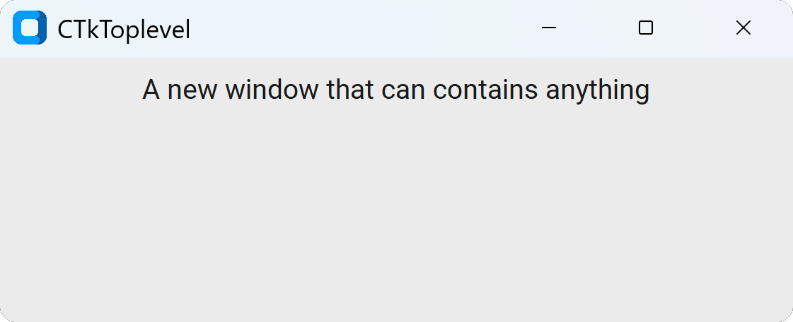

CTkToplevel
===========

The ``CTkToplevel`` class creates an additional application window
that belongs to an existing :doc:`/containers/CTk` root.

It opens when instantiated, so if you want to prepare it in advance,
you can completely hide it with :py:meth:`withdraw()`.
If instead you just want to minimize it in the taskbar,
you can use :py:meth:`iconify()`.

Example Code
------------

.. tab-set::

   .. tab-item:: Functional approach

      .. code:: python

         window = ctk.CTkToplevel(title="CTkToplevel")
         window.geometry("600x500")
         window.withdraw()

         def button_callback() -> None:
             print("button click")

         # add widgets to window
         button = ctk.CTkButton(window, command=button_callback)
         button.pack()

         # show the window
         window.deiconify()

   .. tab-item:: OOP approach

      .. code:: python

         class CustomWindow(ctk.CTkToplevel):
             def __init__(self) -> None:
                 super().__init__(title="CTkToplevel")
                 self.geometry("600x500")
                 self.withdraw()

                 # add widgets to window
                 self.button = ctk.CTkButton(self, command=self.button_callback)
                 self.button.pack()

             def button_callback(self) -> None:
                 print("button click")

         # show the window
         window = CustomWindow()
         window.deiconify()

.. py:class:: CTkToplevel
   :hidden:

   Arguments
   ---------

   Positional
   ~~~~~~~~~~

   .. include:: /arguments/master_window.rst
   .. include:: /arguments/theme_key.rst

   Themed
   ~~~~~~

   .. include:: /arguments/fg_color.rst

   .. py:attribute:: title
      :type: str

      Text to be displayed in the window title bar, near the icon.

   Inherited
   ~~~~~~~~~

   .. py:attribute:: bd
      :type: float | str
   .. py:attribute:: borderwidth
      :type: float | str
   .. py:attribute:: class_
      :type: str
   .. py:attribute:: cursor
      :type: str
   .. py:attribute:: height
      :type: float | str
   .. py:attribute:: width
      :type: float | str
   .. py:attribute:: padx
      :type: float | int | str
   .. py:attribute:: pady
      :type: float | int | str
   .. py:attribute:: highlightthickness
      :type: float | str
   .. py:attribute:: highlightbackground
      :type: str
   .. py:attribute:: highlightcolor
      :type: str
   .. py:attribute:: menu
      :type: tkinter.Menu
   .. py:attribute:: relief
      :type: 'raised' | 'sunken' | 'flat' | 'ridge' | 'solid' | 'groove'
   .. py:attribute:: takefocus
      :type: bool
   .. py:attribute:: container
      :type: bool
   .. py:attribute:: screen
      :type: str
   .. py:attribute:: use
      :type: int | str
   .. py:attribute:: visual
      :type: str | tuple[str, int]

      Inherited attributes from ``tkinter.Toplevel`` widget.

      Check out the :tkdoc:`Tkinter documentation <toplevel>` for their explanation.

   Class attributes
   ~~~~~~~~~~~~~~~~

   |class_attributes_description|

   .. include:: /arguments/deactivate_header_manipulation.rst

   Methods
   -------

   .. include:: /methods/windows.rst
