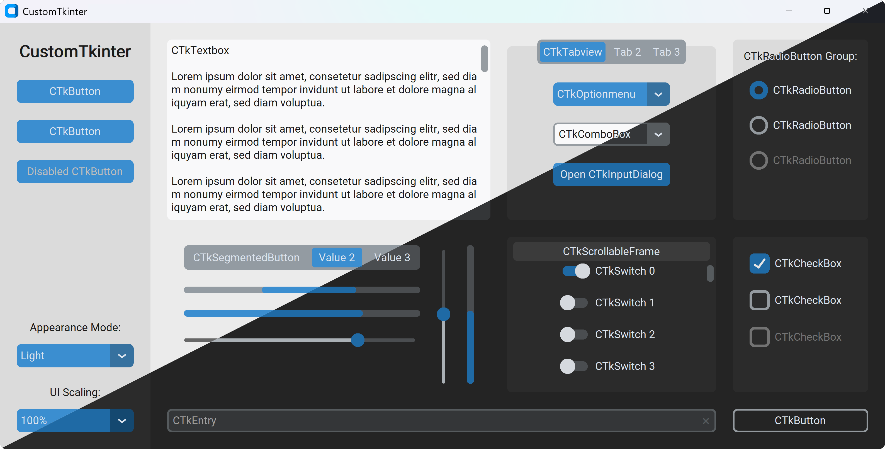

Custom2kinter documentation
===========================

Custom2kinter is a Python UI library based on Tkinter, which provides new,
modern, and fully customizable widgets.
They are created and used like normal Tkinter widgets and can also be used
in combination with normal Tkinter elements.

The widgets and the window colors either adapt to the system appearance or
the manually set mode (light/dark). They also support HighDPI scaling
(on Windows and macOS).

With Custom2kinter you'll get a consistent and modern look across all desktop
platforms (Windows, macOS, Linux):

This project was created to continue the development of CustomTkinter_,
since the original author lost interest in it.
The first release of this library is ``v5.3.0``, which continues the old numbering,
and it is fully compatible with the last released version of the original library.
They can't live together in the same environment, so be sure to uninstall
``customtkinter`` before installing ``custom2kinter``.
This library is still imported using the original name, so existing code doesn't
need to be updated.

This is the official Custom\ **2**\ kinter documentation, but it will use
"Custom\ **T**\ kinter" as the name of the library.
It is also written with the assumption that the developer already knows how
``tkinter`` works, so basic concepts are not explained, and it links
to other resources that explain them.

Main topics
-----------

.. toctree::
   :maxdepth: 1
   :titlesonly:

   concepts/Quickstart
   concepts/AppearanceMode
   concepts/Scaling
   concepts/Theme

.. toctree::
   :caption: API documentation
   :maxdepth: 1
   :titlesonly:

   Configuration
   containers/index
   widgets/index
   utilities/index

.. toctree::
   :caption: Development
   :maxdepth: 1
   :titlesonly:

   development/Contributing
   development/ReleaseProcess
   development/Changelog
   development/License

.. _CustomTkinter: https://pypi.org/project/customtkinter
