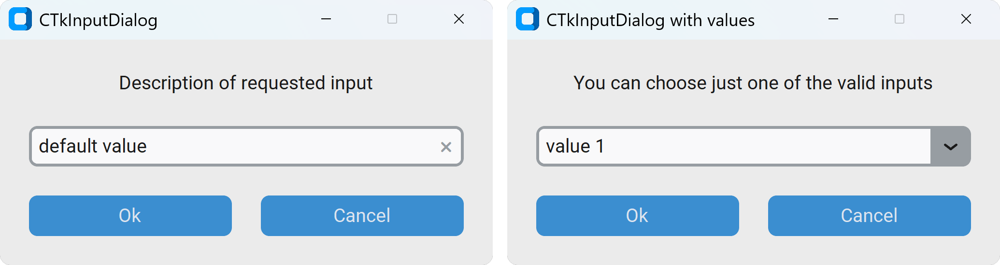

CTkInputDialog
==============

CTkInputDialog is a modal dialog that temporarily asks the user for a string or
a value before the application continues.

Use it when the application needs a short, **blocking** interaction or for important
decisions that require the user's attention.

By default, it contains a :doc:`/widgets/CTkEntry` where the user can type anything.
If :py:attr:`values` attribute is provided, a :doc:`/widgets/CTkComboBox` is used instead.

After instantiating the class, to actually open it, you have to invoke :py:meth:`get_input()`.

Example Code
------------

.. tab-set::

   .. tab-item:: With Entry

      .. code:: python

         dialog = ctk.CTkInputDialog(title="Title",
                                     text="Description of requested input",
                                     default_value="default value")
         text = dialog.get_input()

   .. tab-item:: With ComboBox

      .. code:: python

         dialog = ctk.CTkInputDialog(title="Title",
                                     text="Description of requested input",
                                     values=["option 1", "option 2", "option 3"],
                                     default_value="option 1")
         item = dialog.get_input()

.. py:class:: CTkInputDialog
   :hidden:

   Arguments
   ---------

   Positional
   ~~~~~~~~~~

   .. include:: /arguments/master_window.rst
   .. include:: /arguments/theme_key.rst

   Functionality
   ~~~~~~~~~~~~~

   .. py:attribute:: values
      :type: list[str] | None
      :value: None

      List of strings to be displayed in the Dropdown Menu.

      If omitted or set to ``None``, a simple :doc:`/widgets/CTkEntry` will appear,
      allowing the user to type any value.

   .. py:attribute:: default_value
      :type: str
      :value: ""

      Text/value already present/selected, so the user can just press ENTER to confirm it.

   Themed
   ~~~~~~

   .. include:: /arguments/fg_color.rst
   .. include:: /arguments/text_color.rst

   .. py:attribute:: title
      :type: str

      Text to be displayed in the window title bar, near the icon.

   .. include:: /arguments/text.rst
   .. include:: /arguments/font.rst
   .. include:: /arguments/button.rst
   .. include:: /arguments/entry.rst
   .. include:: /arguments/combobox.rst

   Methods
   -------

   .. py:method:: get_input() -> str | None:

      Opens the popup and waits for the user to close it before returning the selected text/value.

      It returns ``None`` if the user closes the widget with the "X" or "Cancel" button.

      :returns:
         The text typed / the selected value, or ``None``.
