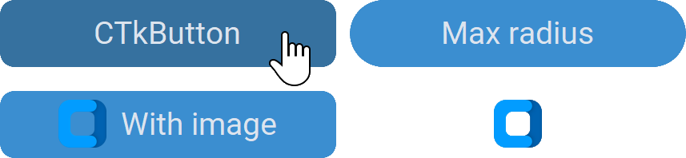

CTkButton
=========

The ``CTkButton`` widget is a clickable button that runs a function when the user presses it.
It can show text and/or an image.

Example Code
------------

.. code:: python

   def callback() -> None:
       print("button pressed")

   button = ctk.CTkButton(app,
                          text="CTkButton",
                          image=("path_to_image", width, height),
                          compound="left",
                          command=callback)

.. py:class:: CTkButton
   :hidden:

   .. _button_arguments:

   Arguments
   ---------

   Positional
   ~~~~~~~~~~

   .. include:: /arguments/master.rst
   .. include:: /arguments/theme_key.rst

   Functionality
   ~~~~~~~~~~~~~

   .. include:: /arguments/state.rst
   .. include:: /arguments/textvariable.rst

   .. py:attribute:: command
      :type: (() -> None) | None
      :value: None

      Function that is invoked when the user clicks on the widget.

   .. include:: /arguments/background_corner_colors.rst

   Themed
   ~~~~~~

   .. include:: /arguments/widtheight.rst
   .. include:: /arguments/corner_radius.rst
   .. include:: /arguments/border_width.rst
   .. include:: /arguments/border_spacing.rst

   .. py:attribute:: internal_spacing
      :type: int

      Space in |unscaled pixels| between label and image.

      .. note::
         If just the text or image is shown, this argument has no effect.

   .. include:: /arguments/bg_color.rst
   .. include:: /arguments/fg_color.rst
   .. include:: /arguments/border_color.rst
   .. include:: /arguments/text_color.rst
   .. include:: /arguments/text_color_disabled.rst
   .. include:: /arguments/text.rst
   .. include:: /arguments/font.rst
   .. include:: /arguments/anchor.rst
   .. include:: /arguments/justify.rst
   .. include:: /arguments/image.rst

   .. py:attribute:: compound
      :type: 'left' | 'right' | 'top' | 'bottom' | 'center'

      Specifies the image's position relative to the text label.

      .. note::
         If just the text or image is shown, this argument has no effect.

   .. include:: /arguments/wraplength.rst
   .. include:: /arguments/hover_color.rst
   .. include:: /arguments/hover.rst

   Class attributes
   ~~~~~~~~~~~~~~~~

   |class_attributes_description|

   .. include:: /arguments/animation_duration.rst

   Methods
   -------

   .. py:method:: invoke() -> None:

      Calls :py:attr:`command` function if the widget's :py:attr:`state` is not ``"disabled"``.

      It can be called to simulate the user who clicks on the widget.

   Inherited
   ~~~~~~~~~

   .. include:: /methods/widget.rst
   .. include:: /methods/geometry_manager.rst
