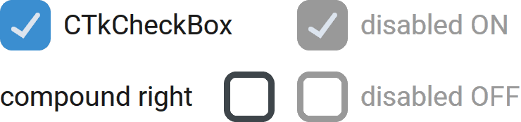

CTkCheckBox
===========

The ``CTkCheckBox`` widget lets the user enable or disable an option.

It has 2 internal states ("on" and "off"), to which you can assign
specific values thanks to :py:attr:`onvalue` or :py:attr:`offvalue`.

It is rendered as a square box that contains a checkmark when the
internal state is "on", placed near a label that contains some text.
If you prefer a different rendering with the same functionality,
you can have a look at :doc:`/widgets/CTkSwitch` or
:doc:`/widgets/CTkToggleButton`.

Use it when one or more choices can be selected at the same time.
For mutually exclusive choices, use :doc:`/widgets/CTkRadioButton`.

Example Code
------------

.. code:: python

   def callback(new_value: str) -> None:
       print("checkbox toggled, current value:", new_value)

   var = ctk.StringVar(value="on")
   checkbox = ctk.CTkCheckBox(app,
                              text="CTkCheckBox",
                              variable=var,
                              onvalue="on",
                              offvalue="off",
                              command=callback)

.. py:class:: CTkCheckBox
   :hidden:

   Arguments
   ---------

   Positional
   ~~~~~~~~~~

   .. include:: /arguments/master.rst
   .. include:: /arguments/theme_key.rst

   Functionality
   ~~~~~~~~~~~~~

   .. include:: /arguments/state.rst
   .. include:: /arguments/textvariable.rst
   .. include:: /arguments/toggleable.rst

   Themed
   ~~~~~~

   .. include:: /arguments/widtheight.rst
   .. include:: /arguments/box_widtheight.rst
   .. include:: /arguments/corner_radius.rst
   .. include:: /arguments/border_width.rst

   .. py:attribute:: internal_spacing
      :type: int

      Space in |unscaled pixels| between the label and the graphical element containing the checkmark.

      .. note::
         If no text is shown, this argument has no effect.

   .. include:: /arguments/bg_color.rst
   .. include:: /arguments/fg_color.rst
   .. include:: /arguments/border_color.rst
   .. include:: /arguments/symbol_color.rst
   .. include:: /arguments/text_color.rst
   .. include:: /arguments/text_color_disabled.rst
   .. include:: /arguments/hover_color.rst
   .. include:: /arguments/hover.rst
   .. include:: /arguments/text.rst
   .. include:: /arguments/font.rst
   .. include:: /arguments/anchor.rst
   .. include:: /arguments/justify.rst

   .. py:attribute:: compound
      :type: 'left' | 'right' | 'top' | 'bottom'

      Specifies the graphical element's position relative to the text label.

      .. note::
         If no text is shown, this argument has no effect.

   Methods
   -------

   .. include:: /methods/toggleable.rst

   Inherited
   ~~~~~~~~~

   .. include:: /methods/widget.rst
   .. include:: /methods/geometry_manager.rst
