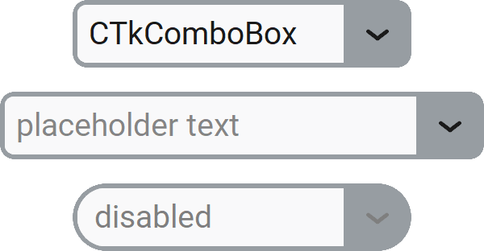

CTkComboBox
===========

The ``CTkComboBox`` widget combines a text entry field with a dropdown list of suggested values.

Thanks to :py:attr:`mode`, you can configure the behavior when the user selects a value from the list.

By default, the user can either select a suggested value or type any text they want.
If you need to restrict the possible values to the ones provided, you can set
:py:attr:`state` to ``"readonly"`` or use :doc:`/widgets/CTkOptionMenu`,
:doc:`/widgets/CTkSegmentedButton`, or :doc:`/widgets/CTkListBox` instead.

If the value is numeric, the best solution is :doc:`/widgets/CTkSpinBox`.

Example Code
------------

.. tab-set::

   .. tab-item:: Replace mode

      .. code:: python

         def callback(choice: str) -> None:
            print("combobox dropdown clicked:", choice)

         combobox = ctk.CTkComboBox(app,
                                    placeholder_text="Select an option",
                                    values=["option 1", "option 2", "option 3"],
                                    command=callback)

   .. tab-item:: Toggle mode

      .. code:: python

         combobox = ctk.CTkComboBox(app,
                                    mode="toggle",
                                    separator="; ",
                                    values=["mother@family.com", "father@family.com",
                                            "brother@family.com", "sister@family.com"])
         ...
         addresses = combobox.get().split(";")

   .. tab-item:: Type mode

      .. code:: python

         combobox = ctk.CTkComboBox(app,
                                    mode="type",
                                    values=["Filter by ID", "Filter by Name", "Filter by Surname"])
         ...
         value_to_search = combobox.get()
         column_to_search_in = combobox.get_type().removeprefix("Filter by ")

   .. tab-item:: Command mode

      .. code:: python

         def callback(value: str) -> None:
             if value == "UPPERCASE":
                 combobox.set(combobox.get().upper())
             elif value == "lowercase":
                 combobox.set(combobox.get().lower())
             elif value == "Title Case":
                 combobox.set(combobox.get().title())
             elif value == "Strip whitespaces":
                 combobox.set(combobox.get().strip())

         combobox = ctk.CTkComboBox(app,
                                    mode="command",
                                    command=callback,
                                    values=["UPPERCASE", "lowercase", "Title Case", "Strip whitespaces"])

.. py:class:: CTkComboBox
   :hidden:

   .. _combobox_arguments:

   Arguments
   ---------

   Positional
   ~~~~~~~~~~

   .. include:: /arguments/master.rst
   .. include:: /arguments/theme_key.rst

   Functionality
   ~~~~~~~~~~~~~

   .. py:attribute:: mode
      :type: 'replace' | 'toggle' | 'type' | 'command'
      :value: 'replace'

      Changes the behavior when the user selects a value from the Dropdown Menu:

      - ``"replace"``:
         The content is replaced with the new value.
      - ``"toggle"``:
         The selected value is added if missing or removed if already present,
         combining multiple values with :py:attr:`separator`.
      - ``"type"``:
         The placeholder text is replaced with the new value, so as to indicate a different usage of the content.

         You can retrieve the last selected "type" with :py:meth:`get_type()`.
      - ``"command"``:
         Just the :py:attr:`command` function is invoked with the new value.

   .. py:attribute:: state
      :type: 'normal' | 'disabled' | 'readonly'
      :value: 'normal'

      If set to ``"disabled"``, the widget will not be responsive to any action performed by the user, and
      no associated callback will be invoked.

      If set to ``"readonly"``, the user won't be able to change the content by typing on the keyboard,
      but they will still be able to select a new value from the Dropdown Menu.

   .. py:attribute:: values
      :type: list[str]
      :value: []

      List of strings to be displayed in the Dropdown Menu.

   .. py:attribute:: separator
      :type: str
      :value: ' '

      String that is used to separate multiple values.

      If :py:attr:`mode` is not ``"toggle"``, this argument has no effect.

   .. py:attribute:: variable
      :type: StringVar | None
      :value: None

      Allows linking this widget to a ``StringVar`` object that can be shared among many widgets.

      |variable_description|

   .. include:: /arguments/commands_multiselect.rst

   Themed
   ~~~~~~

   .. include:: /arguments/widtheight.rst
   .. include:: /arguments/corner_radius.rst
   .. include:: /arguments/border_width.rst
   .. include:: /arguments/border_spacing.rst
   .. include:: /arguments/bg_color.rst
   .. include:: /arguments/fg_color.rst
   .. include:: /arguments/border_color.rst
   .. include:: /arguments/button_color.rst
   .. include:: /arguments/button_hover_color.rst
   .. include:: /arguments/text_color.rst
   .. include:: /arguments/text_color_disabled.rst
   .. include:: /arguments/placeholder_text_color.rst

   .. py:attribute:: placeholder_text
      :type: str
      :value: ''

      Text to be displayed when the widget's value is an empty string.

      If :py:attr:`mode` is ``"type"`` or :py:attr:`variable` is used, this argument is ignored.

   .. include:: /arguments/hover.rst
   .. include:: /arguments/font.rst
   .. include:: /arguments/justify_entry.rst

   .. py:attribute:: compound
      :type: 'left' | 'right'
      :value: 'right'

      Specifies the button's position relative to the text label.

   .. include:: /arguments/dropdown.rst

   Inherited
   ~~~~~~~~~
   
   .. include:: /arguments/tkentry.rst

   Methods
   -------

   .. py:method:: get([index]) -> str:

      | Returns the current widget's content.
      | If :py:attr:`mode` is ``toggle``, it is still a string containing multiple values separated by :py:attr:`separator`.

      If ``index`` is provided, returns the value in :py:attr:`values` at that position.

      :type index: int | None
      :param index:
         Position within :py:attr:`values` to be returned.

         Don't provide this parameter or set it to ``None`` to retrieve the current widget's content.

      :returns:
         String currently displayed in the widget or the value at the provided position.

      :raises IndexError:
         If ``index`` is invalid.

   .. py:method:: set(value) -> None:

      Changes the content to the provided value, regardless of the widget's :py:attr:`state`
      and admissible :py:attr:`values`.

      |no_callbacks|

      :param str value:
         New value to be used as the widget's content.

   .. py:method:: get_type() -> str:

      If :py:attr:`mode` is ``type``, returns the current widget's "type".

      :returns:
         String currently used as placeholder text.

   .. py:method:: set_type(value) -> None:

      If :py:attr:`mode` is ``type``, changes the active "type" to the provided value,
      regardless of the widget's :py:attr:`state` and admissible :py:attr:`values`.

      |no_callbacks|

      :param str value:
         New value to be used as the widget's placeholder text.

   .. py:method:: index([value]) -> int:

      Returns the index of the widget's content within :py:attr:`values`.

      If ``value`` is provided, returns its index instead.

      :type value: str | None
      :param value:
         String you want to know the index of.

         Don't provide this parameter or set it to ``None`` to retrieve the index of the widget's content.

      :returns:
         Index within :py:attr:`values` of the widget's content or the provided value.

      :raises ValueError:
         If ``value`` is not found.

   .. py:method:: invoke() -> None:

      Toggles the visibility status of the Dropdown Menu
      if the widget's :py:attr:`state` is not ``"disabled"``.

      It can be called to simulate the user who clicks on the widget.

   Inherited
   ~~~~~~~~~

   .. include:: /methods/tkentry.rst
   .. include:: /methods/widget.rst
   .. include:: /methods/geometry_manager.rst
