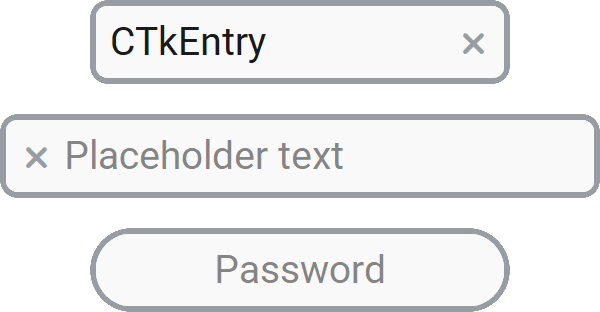

CTkEntry
========

The ``CTkEntry`` widget is a **single-line** text input field.

When its content is empty, :py:attr:`placeholder_text` appears in a lighter color
as a prompt for the expected input.
Thanks to :py:attr:`show`, you can hide the typed text, so as to create a Password entry.

For long text or multi-line input, use :doc:`/widgets/CTkTextbox` instead.
When the user should select from predefined values rather than type freely,
use :doc:`/widgets/CTkOptionMenu`, :doc:`/widgets/CTkComboBox`,
:doc:`/widgets/CTkSegmentedButton`, or :doc:`/widgets/CTkListBox`.

Example Code
------------

.. code:: python

   entry = ctk.CTkEntry(app, placeholder_text="CTkEntry")
   entry.set("Initial text")

.. code:: python

   password = ctk.CTkEntry(app,
                           placeholder_text="Password",
                           show="*",
                           justify="center",
                           compound="none")

.. py:class:: CTkEntry
   :hidden:

   .. _entry_arguments:

   Arguments
   ---------

   Positional
   ~~~~~~~~~~

   .. include:: /arguments/master.rst
   .. include:: /arguments/theme_key.rst

   Functionality
   ~~~~~~~~~~~~~

   .. py:attribute:: state
      :type: 'normal' | 'disabled' | 'readonly'
      :value: 'normal'

      If set to ``"disabled"``, the widget will not be responsive to any action performed by the user.

      If set to ``"readonly"``, the user won't be able to change the content by typing on the keyboard,
      but they will still be able to delete it using the Clear Button.

   .. py:attribute:: textvariable
      :type: StringVar | None
      :value: None

      Allows linking this widget to a ``StringVar`` object that can be shared among many widgets.

      |variable_description|

   .. py:attribute:: pre_command
      :type: (() -> ('break' | None)) | None
      :value: None

      Function that is invoked when the user clicks on the Clear Button,
      but **before** the widget content is actually deleted.

      If the function returns exactly ``"break"``, the content is not deleted
      and :py:attr:`command` is not invoked at all.

   .. py:attribute:: command
      :type: (() -> None) | None
      :value: None

      Function that is invoked when the user clicks on the Clear Button,
      but **after** the widget content has been deleted.

      If the function specified by :py:attr:`pre_command` returned ``"break"``,
      this function is not invoked.

   Themed
   ~~~~~~

   .. include:: /arguments/widtheight.rst

   .. py:attribute:: box_height
      :type: int

      Height of the Clear Button in |unscaled pixels|.

      .. hint::
         Instead of setting it to ``0``, set :py:attr:`compound` to ``"none"`` to hide the button.

   .. include:: /arguments/corner_radius.rst
   .. include:: /arguments/border_width.rst
   .. include:: /arguments/border_spacing.rst
   .. include:: /arguments/bg_color.rst
   .. include:: /arguments/fg_color.rst
   .. include:: /arguments/border_color.rst
   .. include:: /arguments/symbol_color.rst
   .. include:: /arguments/text_color.rst
   .. include:: /arguments/placeholder_text_color.rst

   .. py:attribute:: placeholder_text
      :type: str
      :value: ''

      Text to be displayed when the widget's value is an empty string.

      If :py:attr:`textvariable` is used, this argument is ignored.

   .. include:: /arguments/font.rst
   .. include:: /arguments/justify_entry.rst

   .. py:attribute:: compound
      :type: 'none' | 'left' | 'right'
      :value: 'right'

      Specifies the Clear Button's position relative to the text label.

      Use ``"none"`` to hide the button entirely.

   .. py:attribute:: show
      :type: str
      :value: ''

      If different from ``""``, all characters in the widget will be replaced with this character.
      The actual content is preserved; only the displayed text changes.

      The most used character is ``"*"`` for a Password Entry box.

   Inherited
   ~~~~~~~~~
   
   .. include:: /arguments/tkentry.rst

   Methods
   -------

   .. py:method:: get() -> str:

      Returns the current widget's content.

      :returns:
         String currently displayed in the widget (without considering :py:attr:`show`).

   .. py:method:: set(string) -> None:

      Changes the content to the provided string, regardless of the widget's :py:attr:`state`.

      :param str string:
         New value to be used as the widget's content.

   .. py:method:: invoke() -> None:

      Clears the widget's content
      if the widget's :py:attr:`state` is not ``"disabled"``
      and the :py:attr:`pre_command` doesn't return ``"break"``.

      It can be called to simulate the user who clicks on the Clear Button.

   Inherited
   ~~~~~~~~~

   .. include:: /methods/tkentry.rst
   .. include:: /methods/widget.rst
   .. include:: /methods/geometry_manager.rst
