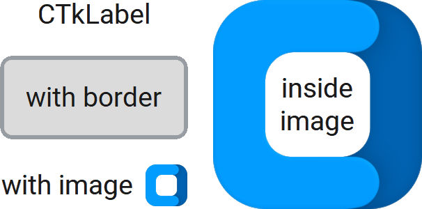

CTkLabel
========

The ``CTkLabel`` widget displays non-editable and non-clickable text and/or image.

By default, the content appears on a transparent background,
but you can configure the attributes to add a rounded, bordered rectangle around it.

Use it for headings, captions, status text, instructions, and other information
that users only need to read.
If needed, you can use :py:meth:`bind()` to allow some sort of interaction.

Example Code
------------

.. code:: python

   label = ctk.CTkLabel(app, text="CTkLabel")

.. code:: python

   imagelabel = ctk.CTkLabel(app,
                             text="Image caption",
                             image=("path_to_image", width, height),
                             compound="top")

.. py:class:: CTkLabel
   :hidden:

   .. _label_arguments:

   Arguments
   ---------

   Positional
   ~~~~~~~~~~

   .. include:: /arguments/master.rst
   .. include:: /arguments/theme_key.rst

   Functionality
   ~~~~~~~~~~~~~

   .. include:: /arguments/textvariable.rst
   .. include:: /arguments/background_corner_colors.rst

   Themed
   ~~~~~~

   .. include:: /arguments/widtheight.rst
   .. include:: /arguments/corner_radius.rst
   .. include:: /arguments/border_width.rst
   .. include:: /arguments/border_spacing.rst

   .. py:attribute:: internal_spacing
      :type: int

      Space in |unscaled pixels| between label and image.

      .. note::
         If just the text or image is shown, this argument has no effect.

   .. include:: /arguments/bg_color.rst
   .. include:: /arguments/fg_color.rst
   .. include:: /arguments/border_color.rst
   .. include:: /arguments/text_color.rst
   .. include:: /arguments/text_color_disabled.rst
   .. include:: /arguments/text.rst
   .. include:: /arguments/font.rst
   .. include:: /arguments/anchor.rst
   .. include:: /arguments/justify.rst
   .. include:: /arguments/image.rst

   .. py:attribute:: compound
      :type: 'left' | 'right' | 'top' | 'bottom' | 'center'

      Specifies the image's position relative to the text label.

      .. note::
         If just the text or image is shown, this argument has no effect.

   .. include:: /arguments/wraplength.rst

   Inherited
   ~~~~~~~~~

   .. py:attribute:: state
      :type: 'normal' | 'disabled'
   .. py:attribute:: takefocus
      :type: bool
   .. py:attribute:: underline
      :type: int

      Inherited attributes from ``tkinter.Label`` widget.

      Check out the :tkdoc:`Tkinter documentation <label>`
      for their explanation.

   Methods
   -------

   Inherited
   ~~~~~~~~~

   .. include:: /methods/widget.rst
   .. include:: /methods/geometry_manager.rst
