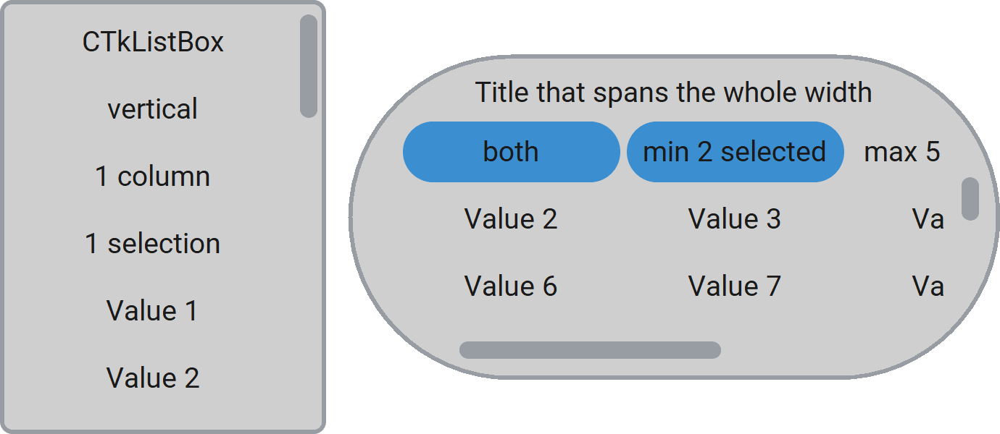

CTkListBox
==========

The ``CTkListBox`` widget presents a vertical and/or horizontal
list of values that the user can select.

It is mainly used when the number of possible values is very big,
since the user can scroll through them.
Moreover, thanks to :py:attr:`max_selected` and :py:attr:`min_selected`,
you can allow multiple items to be selected at the same time and
even force a minimum number of selected items.

For short lists of items where the user must choose just one of them,
you can use :doc:`/widgets/CTkOptionMenu`, :doc:`/widgets/CTkComboBox`,
or :doc:`/widgets/CTkSegmentedButton` instead.

Example Code
------------

.. code:: python

   listbox = ctk.CTkListBox(app,
                            values=[f"option {n}" for n in range(100)],
                            min_selected=2,
                            max_selected=10,
                            orientation="vertical",
                            label={"text": "Select 2 or more options"})

.. py:class:: CTkListBox
   :hidden:

   Arguments
   ---------

   Positional
   ~~~~~~~~~~

   .. include:: /arguments/master.rst
   .. include:: /arguments/theme_key.rst

   Functionality
   ~~~~~~~~~~~~~

   .. include:: /arguments/state.rst

   .. py:attribute:: values
      :type: list[str]
      :value: []

      List of strings to be displayed as separate buttons.

   .. py:attribute:: min_selected
      :type: int
      :value: 0

      | Minimum number of selected values.
      | If the user tries to deselect an additional one, the operation is not performed.

   .. py:attribute:: max_selected
      :type: int
      :value: 1

      | Maximum number of selected values.
      | If the user tries to select an additional one, the behavior depends on :py:attr:`deselect_oldest`.

      .. hint::
         Set it to ``0`` to have no limit.

   .. py:attribute:: deselect_oldest
      :type: bool
      :value: (max_selected == 1)

      When the user tries to select a value above the maximum number defined with :py:attr:`max_selected`,
      if this argument is ``True``, the oldest selected value gets deselected;
      otherwise, the operation is not performed.

      .. note::
         By default, if :py:attr:`max_selected` is ``1``, this argument is ``True``,
         so the user can keep selecting a new value. If multi-selection is allowed,
         the user has to manually deselect a value before selecting a new one.

   .. include:: /arguments/commands_multiselect.rst

   Themed
   ~~~~~~

   .. include:: /arguments/widtheight.rst
   .. include:: /arguments/corner_radius.rst
   .. include:: /arguments/border_width.rst

   .. py:attribute:: internal_spacing
      :type: int

      Space in |unscaled pixels| between buttons.

   .. include:: /arguments/bg_color.rst
   .. include:: /arguments/fg_color.rst
   .. include:: /arguments/top_fg_color.rst
   .. include:: /arguments/border_color.rst
   .. include:: /arguments/border_spacing.rst

   .. py:attribute:: orientation
      :type: 'horizontal' | 'vertical' | 'both'
      :value: 'vertical'

      Defines in which directions the widget can be scrolled and, consequently,
      which :doc:`/widgets/CTkScrollbar` will be shown.

   .. py:attribute:: columns
      :type: int
      :value: 0
   .. py:attribute:: rows
      :type: int
      :value: 0

      Allow to arrange the buttons in multiple columns/rows.

      If needed, you have to provide just one of these arguments,
      but usually ``"columns"`` is used when :py:attr:`orientation` is ``"vertical"``,
      while ``"rows"`` is used when it is ``"horizontal"``.

      .. note::
         If they are both set to ``0``, the buttons will be placed in a single column,
         single row, or a square matrix depending on :py:attr:`orientation`.

   .. include:: /arguments/fit_content.rst
   .. include:: /arguments/show_scrollbars.rst
   .. include:: /arguments/scrollbar.rst
   .. include:: /arguments/label.rst
   .. include:: /arguments/togglebutton.rst

   Methods
   -------

   .. py:method:: get([index]) -> str | list[str]:

      Returns the current selected values.

      If ``index`` is provided, returns the value in :py:attr:`values` at that position.

      :type index: int | None
      :param index:
         Position within :py:attr:`values` to be returned.

         Don't provide this parameter or set it to ``None`` to retrieve the current selected values.

      :returns:
         A single value if ``index`` is provided; otherwise, a list of selected values.

      :raises IndexError:
         If ``index`` is invalid.

   .. py:method:: set(selected_values) -> None:

      Changes the selected values to the provided ones,
      regardless of the widget's :py:attr:`state` and admissible :py:attr:`values`.

      |no_callbacks|

      :type selected_values: list[str]
      :param selected_values:
         The only values that will be selected.

   .. py:method:: invoke(value) -> None:

      Toggles the selection status of the provided value
      if the widget's :py:attr:`state` is not ``"disabled"``,
      the :py:attr:`pre_command` doesn't return ``"break"``,
      and :py:attr:`min_selected` and :py:attr:`max_selected` allow it.

      It can be called to simulate the user who clicks on a specific button.

      :param str value:
         Value whose selection state has to be toggled.

   .. py:method:: index([value]) -> int | list[int]:

      Returns the indexes of the selected values within :py:attr:`values`.

      If ``value`` is provided, returns its index instead.

      :type value: str | None
      :param value:
         Element you want to know the index of.

         Don't provide this parameter or set it to ``None`` to retrieve the indexes of the selected values.

      :returns:
         A single index if ``value`` is provided, or a list of indexes of all selected values.

      :raises ValueError:
         If ``value`` is not found.

   .. py:method:: button(value) -> CTkToggleButton:

      Returns the :doc:`/widgets/CTkToggleButton` object that is showing the provided ``value``.

      It can be used to further customize each button individually,
      for example, to add an image or disable single buttons.

      :param str value:
         Label of the button to return.

      :returns:
         The :doc:`/widgets/CTkToggleButton` object connected to ``value``.

      :raises ValueError:
         If ``value`` is not found.

   Inherited
   ~~~~~~~~~

   .. include:: /methods/scrollableframe.rst
   .. include:: /methods/widget.rst
   .. include:: /methods/geometry_manager.rst
