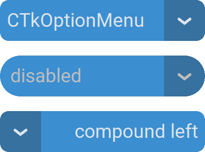

CTkOptionMenu
=============

The ``CTkOptionMenu`` widget lets the user select one value from a dropdown list.

Use it for a compact, constrained choice when the available options do not need to be visible all the time.

For a small set of important choices that should always be visible,
use :doc:`/widgets/CTkSegmentedButton` or several :doc:`/widgets/CTkRadioButton`.
For a very long list of values, use :doc:`/widgets/CTkListBox` instead.

Example Code
------------

.. tab-set::

   .. tab-item:: Without variable

      .. code:: python

         def callback(choice: str) -> None:
             print("optionmenu dropdown clicked:", choice)

         optionmenu = ctk.CTkOptionMenu(app,
                                        values=["option 1", "option 2", "option 3"],
                                        command=callback)
         optionmenu.set("option 2")

   .. tab-item:: With variable

      .. code:: python

         def callback(choice: str) -> None:
             print("optionmenu dropdown clicked:", choice)

         var = ctk.StringVar(value="option 2")
         optionmenu = ctk.CTkOptionMenu(app,
                                        values=["option 1", "option 2", "option 3"],
                                        command=callback,
                                        variable=var)

.. py:class:: CTkOptionMenu
   :hidden:

   Arguments
   ---------

   Positional
   ~~~~~~~~~~

   .. include:: /arguments/master.rst
   .. include:: /arguments/theme_key.rst

   Functionality
   ~~~~~~~~~~~~~

   .. include:: /arguments/state.rst

   .. py:attribute:: values
      :type: list[str]
      :value: []

      List of strings to be displayed in the Dropdown Menu.

   .. py:attribute:: variable
      :type: StringVar | None
      :value: None

      Allows linking this widget to a ``StringVar`` object that can be shared among many widgets.

      |variable_description|

   .. include:: /arguments/commands_multiselect.rst

   Themed
   ~~~~~~

   .. include:: /arguments/widtheight.rst
   .. include:: /arguments/corner_radius.rst
   .. include:: /arguments/border_spacing.rst
   .. include:: /arguments/bg_color.rst
   .. include:: /arguments/fg_color.rst
   .. include:: /arguments/button_color.rst
   .. include:: /arguments/button_hover_color.rst
   .. include:: /arguments/text_color.rst
   .. include:: /arguments/text_color_disabled.rst
   .. include:: /arguments/hover.rst
   .. include:: /arguments/font.rst
   .. include:: /arguments/anchor.rst

   .. py:attribute:: compound
      :type: 'left' | 'right'
      :value: 'right'

      Specifies the button's position relative to the text label.

   .. include:: /arguments/dropdown.rst

   Methods
   -------

   .. py:method:: get([index]) -> str:

      Returns the current selected value.

      If ``index`` is provided, returns the value in :py:attr:`values` at that position.

      :type index: int | None
      :param index:
         Position within :py:attr:`values` to be returned.

         Don't provide this parameter or set it to ``None`` to retrieve the current selected value.

      :returns:
         String currently displayed in the widget or the value at the provided position.

      :raises IndexError:
         If ``index`` is invalid.

   .. py:method:: set(value) -> None:

      Changes the content to the provided value, regardless of the widget's :py:attr:`state`
      and admissible :py:attr:`values`.

      |no_callbacks|

      :param str value:
         New value to be used as the widget's content.

   .. py:method:: index([value]) -> int:

      Returns the index of the selected value within :py:attr:`values`.

      If ``value`` is provided, returns its index instead.

      :type value: str | None
      :param value:
         Element you want to know the index of.

         Don't provide this parameter or set it to ``None`` to retrieve the index of the selected value.

      :returns:
         Index within :py:attr:`values` of the selected or provided value.

      :raises ValueError:
         If ``value`` is not found.

   .. py:method:: invoke() -> None:

      Toggles the visibility status of the Dropdown Menu
      if the widget's :py:attr:`state` is not ``"disabled"``.

      It can be called to simulate the user who clicks on the widget.

   Inherited
   ~~~~~~~~~

   .. include:: /methods/widget.rst
   .. include:: /methods/geometry_manager.rst
