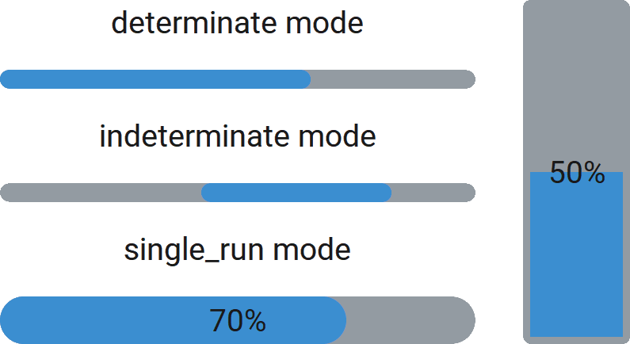

CTkProgressBar
==============

The ``CTkProgressBar`` widget communicates the progress of an operation,
either by showing a known percentage or by animating an indeterminate activity state.

Use it to reassure the user that a task is running and
to show how far a determinate task has progressed.

The widget can automatically update the displayed value based on :py:attr:`mode` and
:py:attr:`progress_speed` after :py:meth:`start()` has been called.
You can also change the value manually with :py:meth:`set()` or :py:meth:`step()`.

Example Code
------------

.. tab-set::

   .. tab-item:: Determinate mode

      .. code:: python

         progressbar = ctk.CTkProgressBar(app, mode="determinate")
         progressbar.start()
         ...
         progressbar.stop()

   .. tab-item:: Indeterminate mode

      .. code:: python

         progressbar = ctk.CTkProgressBar(app, mode="indeterminate")
         progressbar.start()
         ...
         progressbar.stop()

   .. tab-item:: SingleRun mode

      .. code:: python

         progressbar = ctk.CTkProgressBar(app, mode="single_run", show_value=True)
         progressbar.set(value=0.0)
         progressbar.start()

   .. tab-item:: "Manual" mode

      .. code:: python

         progressbar = ctk.CTkProgressBar(app, show_value=True)
         progressbar.set(value=0.0)

         for ...
             progressbar.step(0.01)   OR   progressbar.set(done / todo)

.. py:class:: CTkProgressBar
   :hidden:

   Arguments
   ---------

   Positional
   ~~~~~~~~~~

   .. include:: /arguments/master.rst
   .. include:: /arguments/theme_key.rst

   Functionality
   ~~~~~~~~~~~~~

   .. py:attribute:: mode
      :type: 'determinate' | 'indeterminate' | 'single_run'
      :value: 'determinate'

      Changes how the current value is updated when :py:meth:`start()` method is used:

      - ``"determinate"``:
         When the value reaches ``100%``, it is reset to ``0%`` and it keeps increasing until :py:meth:`stop()` is invoked.
      - ``"indeterminate"``:
         When the value reaches ``100%``, it starts decreasing back to ``0%`` with the same speed.
         Once ``0%`` is reached, it keeps performing the same cycle until :py:meth:`stop()` is invoked.
      - ``"single_run"``:
         When the value reaches ``100%``, it stops automatically.

      If :py:attr:`progress_speed` is negative, ``0%`` and ``100%`` are swapped.

   .. py:attribute:: progress_speed
      :type: float

      Determines how long the current value takes to reach ``100%`` when :py:meth:`start()` method is used.

      The measurement unit of this argument is ``[%/s]``, so if it is set to ``0.5``,
      the current value will take ``1/0.5 = 2 s`` to get from ``0%`` to ``100%``.

      This value can also be negative, so the automatic increment will be negative,
      starting from ``100%`` and reaching ``0%``.

   .. py:attribute:: variable
      :type: DoubleVar | IntVar | None
      :value: None

      Allows linking this widget to a ``DoubleVar`` or ``IntVar`` object that can be shared among many widgets.

      |variable_description|

      If ``IntVar`` is used, the value is converted to a number ``[0-100]``.

   Themed
   ~~~~~~

   .. include:: /arguments/thicknesslength.rst
   .. include:: /arguments/corner_radius.rst
   .. include:: /arguments/border_width.rst
   .. include:: /arguments/bg_color.rst
   .. include:: /arguments/fg_color.rst
   .. include:: /arguments/border_color.rst

   .. py:attribute:: progress_color
      :type: str | tuple[str, str]

      Color of the sliding part that is used to show the current value.

   .. include:: /arguments/text_color.rst
   .. include:: /arguments/font.rst

   .. py:attribute:: show_value
      :type: bool
      :value: False

      If set to ``True``, the current value is displayed in the middle of the widget as a percentage.

   .. py:attribute:: show_zero
      :type: bool
      :value: True

      If :py:attr:`corner_radius` is different from ``0`` and the current value is **exactly** ``0%``,
      the widget shows a roundish shape on the left/bottom, colored with :py:attr:`progress_color`.

      If you set this argument to ``False``, this shape is hidden so as to display the entire
      widget with just :py:attr:`fg_color`. In this way, it actually seems that there is no progress at all.

   Class attributes
   ~~~~~~~~~~~~~~~~

   |class_attributes_description|

   .. py:attribute:: update_time
      :type: int

      Refresh rate of the progress animation, expressed in milliseconds.

      .. hint::
         |update_time_hint|

   .. py:attribute:: indeterminate_width
      :type: float
      :value: 0.4

      Dimension of the progress bar when :py:attr:`mode` is ``"indeterminate"``,
      expressed as a percentage of the available space.

   Methods
   -------

   .. py:method:: get() -> float:

      Returns current value as a number ``[0.0-1.0]``.

      If :py:attr:`mode` is ``"indeterminate"``:

      - 0.0 |r_arrow| progress shape completely on the left/bottom;
      - 0.5 |r_arrow| progress shape completely on the right/top;
      - 1.0 |r_arrow| progress shape again on the left/bottom, ready for a new cycle.

      For other modes:

      - 0.0 |r_arrow| progress shape completely on the left/bottom;
      - 1.0 |r_arrow| progress shape completely on the right/top.

      :returns:
         Current progress value.

   .. py:method:: set([value][, text]) -> None:

      | Sets progress value and/or displayed text to specified values.
      | You can change just one of the 2 values by not providing the other or setting it to ``None``.

      If ``text`` is not provided and :py:attr:`show_value` is ``True``, ``value`` is converted to a string as a percentage.

      :type value: float | None
      :param value:
         New value to be used as the widget's progress value.

      :type text: str | None
      :param text:
         New text to be displayed in the middle of the widget.

   .. py:method:: step(increment) -> None:

      Increases the progress value by the specified amount (it can be negative).

      The new value is automatically clamped in ``[0.0-1.0]``.

      :param float increment:
         Value that is used to change the current progress value.

   .. py:method:: start() -> None:

      Starts automatically changing the current value based on :py:attr:`mode` and :py:attr:`progress_speed`.

      The value is not reset to ``0%`` when this method is invoked; instead, it changes from the current value.

   .. py:method:: stop() -> None:

      Stops automatically changing the current value.

   Inherited
   ~~~~~~~~~

   .. include:: /methods/widget.rst
   .. include:: /methods/geometry_manager.rst
