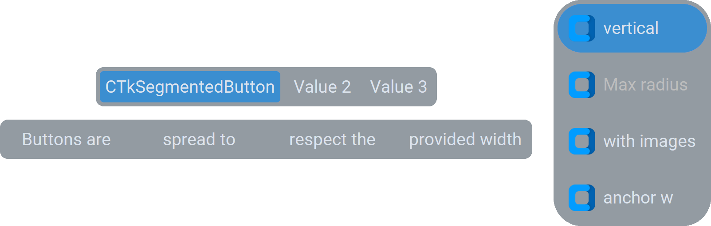

CTkSegmentedButton
==================

The ``CTkSegmentedButton`` widget displays a compact row/column of mutually exclusive choices.

Use it for a small set of related modes, views, or filters where
the choices should remain visible and quickly selectable.

To allow the selection of multiple items, you can use :doc:`/widgets/CTkListBox`.
For independent choices, use :doc:`/widgets/CTkCheckBox`, :doc:`/widgets/CTkSwitch`
or :doc:`/widgets/CTkToggleButton` instead.

Example Code
------------

.. tab-set::

   .. tab-item:: Without variable

      .. code:: python

         def callback(new_value: str) -> None:
             print("segmented button clicked:", new_value)

         segmented_button = ctk.CTkSegmentedButton(app,
                                                   values=["option 1", "option 2", "option 3"],
                                                   command=callback)
         segmented_button.set("option 2")

   .. tab-item:: With variable

      .. code:: python

         def callback(new_value: str) -> None:
             print("segmented button clicked:", new_value)

         var = ctk.StringVar(value="option 2")
         segmented_button = ctk.CTkSegmentedButton(app,
                                                   values=["option 1", "option 2", "option 3"],
                                                   command=callback,
                                                   variable=var)

.. py:class:: CTkSegmentedButton
   :hidden:

   .. _segmentedbutton_arguments:

   Arguments
   ---------

   Positional
   ~~~~~~~~~~

   .. include:: /arguments/master.rst
   .. include:: /arguments/theme_key.rst

   Functionality
   ~~~~~~~~~~~~~

   .. include:: /arguments/state.rst

   .. py:attribute:: values
      :type: list[str]
      :value: []

      List of strings to be displayed as separate buttons.

   .. py:attribute:: variable
      :type: StringVar | None
      :value: None

      Allows linking this widget to a ``StringVar`` object that can be shared among many widgets.

      |variable_description|

   .. include:: /arguments/commands_multiselect.rst
   .. include:: /arguments/background_corner_colors.rst

   Themed
   ~~~~~~

   .. py:attribute:: orientation
      :type: 'horizontal' | 'vertical'
      :value: 'horizontal'

      Specifies how the different buttons are placed within the widget.

   .. py:attribute:: width
      :type: int
      :value: 0

      Width of the widget in |unscaled pixels|.

      If set to ``0``, the widget automatically expands to fit all buttons.

      If the geometry manager used to display the widget has been configured to stretch it, this value is ignored.

   .. py:attribute:: height
      :type: int
      :value: 0

      Height of the widget in |unscaled pixels|.

      If set to ``0``, the widget automatically expands to fit all buttons.

      If the geometry manager used to display the widget has been configured to stretch it, this value is ignored.

   .. py:attribute:: box_width
      :type: int

      Minimum width for each button in |unscaled pixels|.

      If the label requires more space, the button automatically expands to fit it.

   .. py:attribute:: box_height
      :type: int

      Minimum height for each button in |unscaled pixels|.

      If the label requires more space, the button automatically expands to fit it.

   .. include:: /arguments/corner_radius.rst
   .. include:: /arguments/border_width.rst
   .. include:: /arguments/border_spacing.rst
   .. include:: /arguments/bg_color.rst
   .. include:: /arguments/fg_color.rst

   .. py:attribute:: selected_color
      :type: str | tuple[str, str]

      Main color of the selected button.

   .. py:attribute:: unselected_color
      :type: str | tuple[str, str]

      Main color of unselected buttons.

   .. py:attribute:: selected_hover_color
      :type: str | tuple[str, str]

      Main color of the selected button when the user hovers over them with the mouse.

   .. py:attribute:: unselected_hover_color
      :type: str | tuple[str, str]

      Main color of the unselected buttons when the user hovers over them with the mouse.

   .. include:: /arguments/text_color.rst
   .. include:: /arguments/text_color_disabled.rst
   .. include:: /arguments/font.rst
   .. include:: /arguments/anchor.rst

   Methods
   -------

   .. py:method:: get([index]) -> str:

      Returns the current selected value.

      If ``index`` is provided, returns the value in :py:attr:`values` at that position.

      :type index: int | None
      :param index:
         Position within :py:attr:`values` to be returned.

         Don't provide this parameter or set it to ``None`` to retrieve the current selected value.

      :returns:
         Label of the button currently selected or the value at the provided position.

      :raises IndexError:
         If ``index`` is invalid.

   .. py:method:: set(value) -> None:

      Changes the selected value to the provided one,
      regardless of the widget's :py:attr:`state` and admissible :py:attr:`values`.

      |no_callbacks|

      :param str value:
         New value to be used as the widget's content.

   .. py:method:: invoke(value) -> None:

      Changes the selected value to the provided one
      if the widget's :py:attr:`state` is not ``"disabled"``
      and the :py:attr:`pre_command` doesn't return ``"break"``.

      It can be called to simulate the user who clicks on a specific button.

      :param str value:
         New value to be used as the widget's content.

   .. py:method:: index([value]) -> int:

      Returns the index of the selected value within :py:attr:`values`.

      If ``value`` is provided, returns its index instead.

      :type value: str | None
      :param value:
         Element you want to know the index of.

         Don't provide this parameter or set it to ``None`` to retrieve the index of the selected value.

      :returns:
         Index within :py:attr:`values` of the selected or provided value.

      :raises ValueError:
         If ``value`` is not found.

   .. py:method:: insert(index, value) -> None:

      Creates a new button with the given ``value`` and places it at the position provided with ``index``.

      :param int index:
         Position at which the new button will be placed.

      :param str value:
         Label to be used for the new button.

      :raises ValueError:
         If ``value`` is ``""`` or already present in :py:attr:`values`.

   .. py:method:: add(value) -> None:

      Creates a new button with the given ``value`` and places it at the end.

      :param str value:
         Label to be used for the new button.

      :raises ValueError:
         If ``value`` is ``""`` or already present in :py:attr:`values`.

   .. py:method:: delete(value) -> None:

      Deletes the button with the given ``value``.

      :param str value:
         Label of the button to be deleted.

      :raises ValueError:
         If ``value`` is not found.

   .. py:method:: move(new_index, value) -> None:

      Moves the button with the given ``value`` at the position provided with ``new_index``.

      :param int new_index:
         Position at which the button will be placed.

      :param str value:
         Label of the button to be moved.

      :raises ValueError:
         If ``new_index`` is an invalid index for :py:attr:`values`.

         If ``value`` is not found.

   .. py:method:: len() -> int:

      Returns the number of buttons.

      :returns:
         The length of :py:attr:`values`.

   .. py:method:: button(value) -> CTkButton:

      Returns the :doc:`/widgets/CTkButton` object that is showing the provided ``value``.

      It can be used to further customize each button individually,
      for example, to add an image or disable single buttons.

      :param str value:
         Label of the button to return.

      :returns:
         The :doc:`/widgets/CTkButton` object connected to ``value``.

      :raises ValueError:
         If ``value`` is not found.

   Inherited
   ~~~~~~~~~

   .. include:: /methods/widget.rst
   .. include:: /methods/geometry_manager.rst
