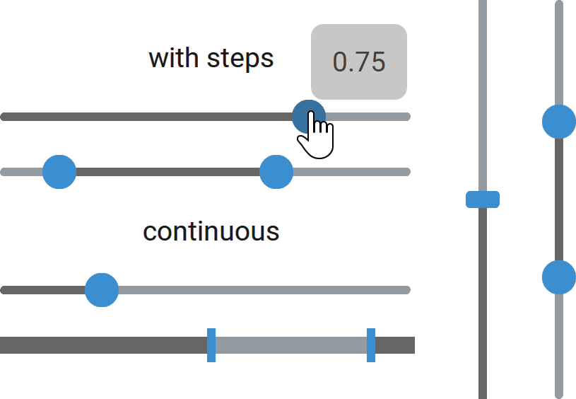

CTkSlider
=========

The ``CTkSlider`` widget lets the user choose a numeric value by dragging a handle along a range.

Based on :py:attr:`mode`, the user can also choose 2 numeric values that define a sub-range.

Use it when the value does not need to be very precise.
To allow the user to select an exact value, use :doc:`/widgets/CTkSpinBox` instead.

Example Code
------------

.. tab-set::

   .. tab-item:: Single mode

      .. code:: python

         def callback(new_value: float) -> None:
             print("slider value changed:", new_value)

         var = ctk.IntVar(value=50)
         slider = ctk.CTkSlider(app,
                                from_=0,
                                to=100,
                                format="{:.0f} %",
                                command=callback,
                                variable1=var)

   .. tab-item:: InRange mode

      .. code:: python

         def callback(min_value: float, max_value: float) -> None:
             print("slider range changed:", min_value, max_value)

         varmin = ctk.IntVar(value=10)
         varmax = ctk.IntVar(value=50)
         slider = ctk.CTkSlider(app,
                                mode="in_range",
                                from_=0,
                                to=60,
                                number_of_steps=60,
                                format="{:.0f} s",
                                command=callback,
                                variable1=varmin,
                                variable2=varmax)

   .. tab-item:: OutRange mode

      .. code:: python

         def callback(min_value: float, max_value: float) -> None:
             print("slider range changed:", min_value, max_value)

         varmin = ctk.DoubleVar(value=1.1)
         varmax = ctk.DoubleVar(value=1.9)
         slider = ctk.CTkSlider(app,
                                mode="out_range",
                                from_=1.0,
                                to=2.0,
                                format="x{:.1f}",
                                command=callback,
                                variable1=varmin,
                                variable2=varmax)

   .. tab-item:: AnyRange mode

      .. code:: python

         def callback(value1: float, value2: float) -> None:
             if (value1 <= value2):
                 print("slider range changed, inside:", value1, value2)
             else:
                 print("slider range changed, outside:", value2, value1)

         slider = ctk.CTkSlider(app,
                                mode="any_range",
                                from_=-100.0,
                                to=100.0,
                                command=callback)
         slider.set(-50.0, 50.0)

.. py:class:: CTkSlider
   :hidden:

   Arguments
   ---------

   Positional
   ~~~~~~~~~~

   .. include:: /arguments/master.rst
   .. include:: /arguments/theme_key.rst

   Functionality
   ~~~~~~~~~~~~~

   .. py:attribute:: mode
      :type: 'single' | 'in_range' | 'out_range' | 'any_range'
      :value: 'single'

      Changes the number of buttons, admissible values and colored section:

      - ``"single"``:
         1 button with the highlighted part towards left/bottom and no additional limits.
      - ``"in_range"``:
         2 buttons with the highlighted part in the middle.

         The buttons can never swap positions, so it is guaranteed that ``value1 <= value2`` [1]_.
      - ``"out_range"``:
         2 buttons with the highlighted part going outwards.

         The buttons can never swap positions, so it is guaranteed that ``value1 <= value2`` [1]_.
      - ``"any_range"``:
         2 buttons that can swap positions. If ``value1 <= value2`` [1]_, it behaves like ``"in_range"``,
         otherwise like ``"out_range"``.

   .. include:: /arguments/state.rst

   .. py:attribute:: from_
      :type: int | float
      :value: 0.0

      Value returned by :py:meth:`get()` when the slider is at its minimum position (left/bottom).

      It can be greater than :py:attr:`to`: in that case,
      the output value will decrease the more the user moves the slider towards the right/top.

      .. note::
         The ``_`` at the end is needed because ``from`` is a Python keyword.

   .. py:attribute:: to
      :type: int | float
      :value: 1.0

      Value returned by :py:meth:`get()` when the slider is at its maximum position (right/top).

      It can be smaller than :py:attr:`from_`: in that case,
      the output value will decrease the more the user moves the slider towards the right/top.

   .. py:attribute:: number_of_steps
      :type: int | None
      :value: None

      If set to a number, the sliders will have a limited number of positions they can be in.

      For example, by setting :py:attr:`from_` to ``1``, :py:attr:`to` to ``10`` and this parameter to ``10``,
      the admissible values will be only the integers from 1 to 10.

   .. include:: /arguments/format.rst

   .. py:attribute:: scrollincrement
      :type: float
      :value: 1/number_of_steps | 0.05

      Percentage amount by which the slider value is changed when the user scrolls on the widget with the mouse wheel.

      For example, if it is set to ``0.1``, it would take 10 scroll events to get from the minimum to the maximum value.
      With ``0.5``, it would take just 2.

   .. py:attribute:: variable1
      :type: DoubleVar | IntVar | None
      :value: None

      Allows linking the **first or only slider** to a ``DoubleVar`` or ``IntVar`` object that can be shared among many widgets.

      |variable_description|

      If ``IntVar`` is used, the value is rounded to an integer using :py:func:`round()`.

   .. py:attribute:: variable2
      :type: DoubleVar | IntVar | None
      :value: None

      Allows linking the **second or only slider** to a ``DoubleVar`` or ``IntVar`` object that can be shared among many widgets.

      |variable_description|

      If ``IntVar`` is used, the value is rounded to an integer using :py:func:`round()`.

   .. py:attribute:: command
      :type: ((float) -> None) | ((float, float) -> None) | None
      :value: None

      Function that is invoked when the user changes any slider in any way (click, drag, scroll).

      The function receives the new value as its only parameter if :py:attr:`mode` is ``"single"``;
      otherwise, it receives both sliders' values, even the one that hasn't changed.

      If :py:attr:`mode` is ``"any_range"``, the first parameter could be greater than the second one [1]_:
      in that case, it means that the "outside range" is requested, and you should manage it properly.

   Themed
   ~~~~~~

   .. include:: /arguments/thicknesslength.rst

   .. py:attribute:: button_length
      :type: int
      :value: 0

      Length of each slider in |unscaled pixels|.

      This value refers only to the straight section that connects the rounded corners,
      so the actual total length of the slider will be the sum of this parameter and
      2 times :py:attr:`corner_radius`.

   .. include:: /arguments/corner_radius.rst
   .. include:: /arguments/border_width.rst
   .. include:: /arguments/bg_color.rst
   .. include:: /arguments/fg_color.rst
   .. include:: /arguments/button_color.rst
   .. include:: /arguments/button_hover_color.rst
   .. include:: /arguments/border_color.rst

   .. py:attribute:: progress_color
      :type: str | tuple[str, str] | 'transparent'

      Color of the highlighted part that displays the value/range.

   .. include:: /arguments/hover.rst

   .. py:attribute:: show_value
      :type: bool
      :value: True

      If set to ``True``, the slider's value is displayed in a
      :doc:`/widgets/CTkToolTip` object while it is being changed.

   .. include:: /arguments/tooltip.rst

   Class attributes
   ~~~~~~~~~~~~~~~~

   |class_attributes_description|

   .. py:attribute:: enable_combo_movements
      :type: bool
      :value: True

      If set to ``True``, when the user moves a slider,
      the other slider is moved along if specific keys are pressed:

      - ``shift``:
         In the same direction, so as to preserve the distance between the sliders.
      - ``ctrl``:
         In the opposite direction, so as to maintain the center in the same place (zoom effect).

   Methods
   -------

   .. py:method:: get() -> float | tuple[float, float]:

      Returns the current value/range.

      If :py:attr:`mode` is ``"single"``, it returns a single float.
      For other modes, it returns a tuple of 2 floats, with the first element
      representing the minimum value of the range and the second the maximum.

      If :py:attr:`mode` is ``"any_range"``, the minimum value could be bigger
      than the maximum to indicate an "outside range".
      For other modes, it is guaranteed that ``min <= max`` [1]_.

      :returns:
         A single value or a tuple of 2 elements based on :py:attr:`mode`.

   .. py:method:: set([output_value1][, output_value2]) -> None:

      Changes the sliders position to the provided values, regardless of the widget's :py:attr:`state`.

      If :py:attr:`mode` is ``"single"``, you can use any of the 2 arguments.

      For other modes, ``output_value1`` is used for the slider that is usually associated with the minimum value,
      while ``output_value2`` is used for the slider that is associated with the maximum value
      (they can be flipped if :py:attr:`mode` is ``"any_range"``).

      You can omit one of the parameters or set it to ``None`` to preserve its value or
      you can provide a 2-element tuple as the only parameter and
      it will be automatically unpacked in the 2 arguments.

      :py:attr:`command` is not invoked by calling this method.

      :type output_value1: float | tuple[float, float] | None
      :param output_value1:
         New value to be used for the minimum or only slider.

         If it is a tuple, the second element will be used as ``output_value2``.

      :type output_value2: float | None
      :param output_value2:
         New value to be used for the maximum or only slider.

   Inherited
   ~~~~~~~~~

   .. include:: /methods/widget.rst
   .. include:: /methods/geometry_manager.rst

   .. [1] Only if ``from_ <= to``, otherwise the opposite is true.
