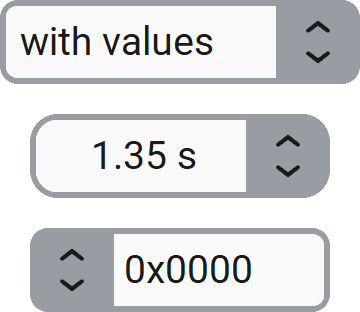

CTkSpinBox
==========

The ``CTkSpinBox`` widget allows the user to enter a value or
adjust it with increment and decrement buttons.

It also has the possibility to display values inside a list,
to force a non-linear progression or restrict the allowed values
(for this, set :py:attr:`state` to ``"readonly"``).

You can also format and/or complete the displayed value by adding a prefix and/or suffix.
This is useful for limiting the number of decimal digits or adding a unit of measurement.

If the value doesn't need to be very precise, you can use :doc:`/widgets/CTkSlider`
since dragging is faster.
For non-numeric values, use :doc:`/widgets/CTkComboBox` instead.

Example Code
------------

.. tab-set::

   .. tab-item:: Any value

      .. code:: python

         def callback(new_value: float) -> None:
             print("spinbox value changed:", new_value)

         var = ctk.DoubleVar(value=0.0)
         spinbox = ctk.CTkSpinBox(app,
                                  command=callback,
                                  variable=var)

   .. tab-item:: Constrained value

      .. code:: python

         spinbox = ctk.CTkSpinBox(app,
                                  from_=0.0,
                                  to=60.0,
                                  buttonincrement=1.0,
                                  scrollincrement=10.0,
                                  format="{:.0f} s")
         spinbox.set(30)

   .. tab-item:: Suggested values

      .. code:: python

         spinbox = ctk.CTkSpinBox(app,
                                  values=[1, 2, 5, 10, 20, 50, 100, 200, 500],
                                  format="\u20AC {:.0f}")
         spinbox.set(10)

.. py:class:: CTkSpinBox
   :hidden:

   Arguments
   ---------

   Positional
   ~~~~~~~~~~

   .. include:: /arguments/master.rst
   .. include:: /arguments/theme_key.rst

   Functionality
   ~~~~~~~~~~~~~

   .. py:attribute:: state
      :type: 'normal' | 'disabled' | 'readonly'
      :value: 'normal'

      If set to ``"disabled"``, the widget will not be responsive to any action performed by the user, and
      no associated callback will be invoked.

      If set to ``"readonly"``, the user won't be able to change the content by typing on the keyboard,
      but they can still change it by clicking the buttons or scrolling over the widget.

   .. py:attribute:: from_
      :type: int | float | None
      :value: None

      If set to a number, it will be considered the lower limit under which the widget's value can't go.

      .. note::
         The ``_`` at the end is needed because ``from`` is a Python keyword.

   .. py:attribute:: to
      :type: int | float | None
      :value: None

      If set to a number, it will be considered the upper limit above which the widget's value can't go.

   .. py:attribute:: values
      :type: list[int | float | str] | None
      :value: None

      | List of values to be displayed.
      | The variations are applied to the index of the selected item.

      It can be used if you don't want to follow a linear progression:
      just provide a list of possible values (e.g. ``[1, 2, 5, 10, 20, 50, 100, 200, 500]``).

      If :py:attr:`from_` and/or :py:attr:`to` are provided,
      their limits are applied to the admissible indexes
      (so out of a big list, you can allow just a subset of values).

   .. include:: /arguments/format.rst

   .. py:attribute:: buttonincrement
      :type: int | float
      :value: 1 | scrollincrement

      Amount by which the value should change when the user clicks on the buttons.

      It can be negative to swap the behavior of the buttons.

   .. py:attribute:: scrollincrement
      :type: int | float
      :value: 1 | buttonincrement

      Amount by which the value should change when the user scrolls the widget with the mouse wheel.

      It can be negative to reverse the direction of the mouse wheel.

   .. py:attribute:: variable
      :type: IntVar | DoubleVar | StringVar | None
      :value: None

      Allows linking this widget to an ``IntVar``, ``DoubleVar`` or ``StringVar`` object
      that can be shared among many widgets.

      |variable_description|

      If ``IntVar`` is used, the value is rounded to an integer using :py:func:`round()`.
      For ``StringVar``, the value is converted using ``str()``.

   .. py:attribute:: pre_command
      :type: ((int | float | str) -> ('break' | None)) | None
      :value: None

      Function that is invoked when the user performs an action to change the value,
      but **before** the widget content is actually changed.
      It receives the new potential value as its only parameter.

      If the function returns exactly ``"break"``, the content is not changed
      and :py:attr:`command` is not invoked at all.

   .. py:attribute:: command
      :type: ((int | float | str) -> None) | None
      :value: None

      Function that is invoked when the user performs an action to change the value,
      but **after** the widget content has been changed.
      It receives the new value as its only parameter.

      If the function specified by :py:attr:`pre_command` returned ``"break"``,
      this function is not invoked.

   Themed
   ~~~~~~

   .. include:: /arguments/widtheight.rst
   .. include:: /arguments/corner_radius.rst
   .. include:: /arguments/border_width.rst
   .. include:: /arguments/border_spacing.rst
   .. include:: /arguments/bg_color.rst
   .. include:: /arguments/fg_color.rst
   .. include:: /arguments/border_color.rst
   .. include:: /arguments/button_color.rst
   .. include:: /arguments/button_hover_color.rst
   .. include:: /arguments/text_color.rst
   .. include:: /arguments/text_color_disabled.rst
   .. include:: /arguments/hover.rst
   .. include:: /arguments/font.rst
   .. include:: /arguments/justify_entry.rst

   .. py:attribute:: compound
      :type: 'left' | 'right'
      :value: 'right'

      Specifies the buttons' position relative to the text label.

   Inherited
   ~~~~~~~~~
   
   .. include:: /arguments/tkentry.rst

   Class attributes
   ~~~~~~~~~~~~~~~~

   |class_attributes_description|

   .. py:attribute:: repeated_increment_first_time
      :type: int
   .. py:attribute:: repeated_increment_last_time
      :type: int
   .. py:attribute:: repeated_increment_factor
      :type: float

      If a button is kept pressed, its effects are repeated after some time.
      These parameters allow you to configure the speed at which this happens:

      - ``first_time``:
         | It is the first time, in milliseconds, that is initially waited to repeat the operation.
         | It controls when the repeated operation starts.
      - ``last_time``:
         | It is the minimum time, in milliseconds, that is waited to repeat the operation after the button has been kept pressed long enough.
         | It controls the final speed for the repeated operations.
      - ``factor``:
         | The next wait time is calculated by multiplying the current time by this factor until it reaches the minimum time.
         | It controls how fast the final speed is reached.

      .. hint::
         Set ``repeated_increment_first_time`` to ``-1`` to disable this functionality completely.

   Methods
   -------

   .. py:method:: get() -> int | float | str:

      Returns the current widget's value.

      It tries to convert the Entry content from a string to a number based on the specified format,
      but if it fails, it returns the string unchanged
      (the user can always write an invalid value if :py:attr:`state` is ``"normal"``).

      :returns:
         The value currently displayed in the widget.

   .. py:method:: set(value) -> None:

      Changes the content to the provided value, regardless of the widget's :py:attr:`state`,
      admissible :py:attr:`values` and limits (:py:attr:`from_` - :py:attr:`to`).

      The value is converted to a string using :py:attr:`format` and then written in the Entry.

      |no_callbacks|

      :type value: int | float | str
      :param value:
         New value to be used as the widget's content.

   .. py:method:: invoke(direction, type_) -> None:

      Changes the current value following the provided direction and using the proper amount
      if the widget's :py:attr:`state` is not ``"disabled"``
      and the :py:attr:`pre_command` doesn't return ``"break"``.

      If ``direction`` is ``"none"``, just the format is applied
      (useful in case it is missing after the user has typed a new value).

      It can be called to simulate the user who clicks or scrolls on the widget.

      :type direction: 'top' | 'bottom' | 'none'
      :param direction:
         Specifies if the value should be increased (``"top"``), decreased (``"bottom"``),
         or just be reformatted (``"none"``).

      :type type_: 'button' | 'scroll'
      :param type_:
         Depending on the operation type, the value changes by an amount configurable via
         :py:attr:`buttonincrement` and :py:attr:`scrollincrement`.

   Inherited
   ~~~~~~~~~

   .. include:: /methods/tkentry.rst
   .. include:: /methods/widget.rst
   .. include:: /methods/geometry_manager.rst
