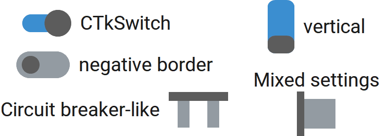

CTkSwitch
=========

The ``CTkSwitch`` widget lets the user enable or disable an option.

It has 2 internal states ("on" and "off"), to which you can assign
specific values thanks to :py:attr:`onvalue` or :py:attr:`offvalue`.

It is rendered as a square box that contains a switch, whose color
and position depends on internal state, placed near a label that
contains some text.
If you prefer a different rendering with the same functionality,
you can have a look at :doc:`/widgets/CTkCheckBox` or
:doc:`/widgets/CTkToggleButton`.

Use it when one or more choices can be selected at the same time.
For mutually exclusive choices, use :doc:`/widgets/CTkRadioButton`.

Example Code
------------

.. code:: python

   def callback(new_value: str) -> None:
       print("switch toggled, current value:", new_value)

   var = ctk.StringVar(value="on")
   switch = ctk.CTkSwitch(app,
                          text="CTkSwitch",
                          variable=var,
                          onvalue="on",
                          offvalue="off",
                          command=callback)

.. py:class:: CTkSwitch
   :hidden:

   Arguments
   ---------

   Positional
   ~~~~~~~~~~

   .. include:: /arguments/master.rst
   .. include:: /arguments/theme_key.rst

   Functionality
   ~~~~~~~~~~~~~

   .. include:: /arguments/state.rst
   .. include:: /arguments/textvariable.rst
   .. include:: /arguments/toggleable.rst

   Themed
   ~~~~~~

   .. py:attribute:: orientation
      :type: 'horizontal' | 'vertical'
      :value: 'horizontal'

      Specifies how to convert :py:attr:`thickness` and :py:attr:`length` in ``width`` and ``height`` **for the graphical element**.

   .. py:attribute:: thickness
      :type: int

      | Thickness **of the graphical element** in |unscaled pixels|.
      | It is used as the ``width`` or ``height`` of the graphical element based on :py:attr:`orientation`.

   .. py:attribute:: length
      :type: int

      | Length **of the graphical element** in |unscaled pixels|.
      | It is used as the ``width`` or ``height`` of the graphical element based on :py:attr:`orientation`.

   .. include:: /arguments/widtheight.rst

   .. py:attribute:: button_length
      :type: int
      :value: 0

      Length of button in |unscaled pixels|.

      This value refers only to the straight section that connects the rounded corners,
      so the actual total length of the button will be the sum of this parameter and
      2 times :py:attr:`corner_radius`.

   .. include:: /arguments/corner_radius.rst

   .. py:attribute:: border_width
      :type: int

      Width of the widget's border in |unscaled pixels|.

      .. hint::
         | Set it to a negative value to apply a border to the button itself.
         | This creates a switch with a different style, as shown in the image at the top of the page.

      .. warning::
         The border is included in the total width and height of the widget,
         so if this value is half ``width`` or ``height``, the actual content is hidden.

   .. py:attribute:: internal_spacing
      :type: int

      Space in |unscaled pixels| between the label and the graphical element containing the actual switch.

      .. note::
         If no text is shown, this argument has no effect.

   .. include:: /arguments/bg_color.rst

   .. py:attribute:: fg_color_checked
      :type: str | tuple[str, str]

      Main color of the widget when the internal state is "on".

   .. py:attribute:: fg_color_unchecked
      :type: str | tuple[str, str]

      Main color of the widget when the internal state is "off".

   .. include:: /arguments/button_color.rst
   .. include:: /arguments/button_hover_color.rst
   .. include:: /arguments/border_color.rst
   .. include:: /arguments/text_color.rst
   .. include:: /arguments/text_color_disabled.rst
   .. include:: /arguments/hover.rst
   .. include:: /arguments/text.rst
   .. include:: /arguments/font.rst
   .. include:: /arguments/anchor.rst
   .. include:: /arguments/justify.rst

   .. py:attribute:: compound
      :type: 'left' | 'right' | 'top' | 'bottom'

      Specifies the graphical element's position relative to the text label.

      .. note::
         If no text is shown, this argument has no effect.

   Methods
   -------

   .. include:: /methods/toggleable.rst

   Inherited
   ~~~~~~~~~

   .. include:: /methods/widget.rst
   .. include:: /methods/geometry_manager.rst
