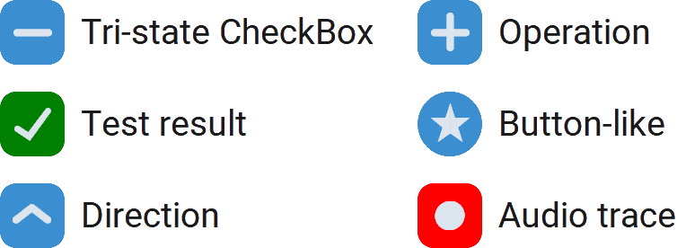

CTkSymbolBox
============

The ``CTkSymbolBox`` widget draws a small predefined symbol,
letting the user choose from a list of provided symbols.

The user can advance in the list by clicking the widget with
the left button, and they can go back with the right button.

It is a generalized version of :doc:`/widgets/CTkCheckBox`,
and it was born to create a tri-state checkbox
(usually used to display mixed or unknown values).

You can use it to allow the user to select a direction,
a math operation or anything you think appropriate.
If just 1 symbol is provided, the widget behaves like a
:doc:`/widgets/CTkButton`, showing a brief animation
when clicked.

.. py:type:: SymbolType
   :canonical: str

   Possible symbols that the widget is capable of showing:

   - ``""``: empty
   - ``"+"``: + sign
   - ``"x"``: x sign
   - ``"|"``: | sign
   - ``"/"``: / sign
   - ``"-"``: - sign
   - ``"\"``: \\ sign
   - ``"^"``: arrow pointing up
   - ``">"``: arrow pointing right
   - ``"v"``: arrow pointing down
   - ``"<"``: arrow pointing left
   - ``"check"``: checkmark sign
   - ``"circle"``: circle shape
   - ``"rect"``: rectangle shape
   - ``"play"``: "play" shape
   - ``"star"``: star shape

Example Code
------------

.. tab-set::

   .. tab-item:: Test result

      .. code:: python

         def callback(new_index: int) -> None:
             print("symbol changed, current index:", new_index)

         symbolbox = ctk.CTkSymbolBox(app,
                                      text="Test result",
                                      values=["", "check", "x"],
                                      fg_color=["transparent", "green", "red"],
                                      command=callback)
         symbolbox.set("x")

   .. tab-item:: Tri-state CheckBox

      .. code:: python

         class TriStateBox(ctk.CTkSymbolBox):
             def __init__(self, master, theme_key = None, **kwargs) -> None:
                 super().__init__(master,
                                  theme_key,
                                  values=["", "check", "-"],
                                  **kwargs)

             def set_state(self, value: bool | None) -> None:
                 super().set(index=2 if value is None else int(value))

             def get_state(self) -> bool | None:
                 symbol = super().get()
                 return None if symbol == "-" else symbol == "check"

   .. tab-item:: Button-like

      .. code:: python

         def callback(*_: Any) -> None:
             print("symbol pressed")

         symbolbox = ctk.CTkSymbolBox(app,
                                      text="Add to favorites",
                                      values=["star"],
                                      corner_radius=1000,
                                      command=callback)

.. py:class:: CTkSymbolBox
   :hidden:

   .. _symbolbox_arguments:

   Arguments
   ---------

   Positional
   ~~~~~~~~~~

   .. include:: /arguments/master.rst
   .. include:: /arguments/theme_key.rst

   Functionality
   ~~~~~~~~~~~~~

   .. include:: /arguments/state.rst

   .. py:attribute:: values
      :type: list[SymbolType]
      :value: []

      List of symbols to be displayed one after the other.

      Duplicates are accepted and properly managed. If this parameter contains just a single element,
      the widget behaves like a :doc:`/widgets/CTkButton` when left-clicked (click animation).

   .. include:: /arguments/textvariable.rst

   .. py:attribute:: variable
      :type: StringVar | None
      :value: None

      Allows linking this widget to a ``StringVar`` object that can be shared among many widgets.

      |variable_description|

   .. py:attribute:: pre_command
      :type: ((int) -> ('break' | None)) | None
      :value: None

      Function that is invoked when the user changes the selected symbol,
      but **before** the widget content is actually changed.
      It receives the index of the selected symbol as its only parameter.

      If the function returns exactly ``"break"``, the content is not changed
      and :py:attr:`command` is not invoked at all.

   .. py:attribute:: command
      :type: ((int) -> None) | None
      :value: None

      Function that is invoked when the user changes the selected symbol,
      but **after** the widget content has been changed.
      It receives the index of the selected symbol as its only parameter.

      If the function specified by :py:attr:`pre_command` returned ``"break"``,
      this function is not invoked.

   Themed
   ~~~~~~

   .. include:: /arguments/widtheight.rst
   .. include:: /arguments/box_widtheight.rst
   .. include:: /arguments/corner_radius.rst
   .. include:: /arguments/border_width.rst

   .. py:attribute:: internal_spacing
      :type: int

      Space in |unscaled pixels| between the label and the graphical element containing the symbol.

      .. note::
         If no text is shown, this argument has no effect.

   .. include:: /arguments/bg_color.rst

   .. py:attribute:: fg_color
      :type: str | tuple[str, str] | 'transparent' | list[str | tuple[str, str] | 'transparent']

      Main color of the widget.

      You can even provide a list of multiple colors: the widget will use the one
      at the position given by the displayed symbol's index.
      If this list is shorter, it will use the last color for subsequent symbols.

   .. include:: /arguments/border_color.rst
   .. include:: /arguments/symbol_color.rst
   .. include:: /arguments/hover_color.rst
   .. include:: /arguments/text_color.rst
   .. include:: /arguments/text_color_disabled.rst
   .. include:: /arguments/hover.rst
   .. include:: /arguments/text.rst
   .. include:: /arguments/font.rst
   .. include:: /arguments/anchor.rst
   .. include:: /arguments/justify.rst

   .. py:attribute:: compound
      :type: 'left' | 'right' | 'top' | 'bottom'

      Specifies the graphical element's position relative to the text label.

      .. note::
         If no text is shown, this argument has no effect.

   Class attributes
   ~~~~~~~~~~~~~~~~

   |class_attributes_description|

   .. py:attribute:: pacman_effect
      :type: bool
      :value: True

      If set to ``True``, the first element is shown after the last;
      otherwise, the user has to "scroll" in the opposite direction (right-click).

   .. include:: /arguments/animation_duration.rst

   Methods
   -------

   .. py:method:: get([index]) -> SymbolType:

      Returns the current selected symbol.

      If ``index`` is provided, returns the symbol in :py:attr:`values` at that position.

      :type index: int | None
      :param index:
         Position within :py:attr:`values` to be returned.

         Don't provide this parameter or set it to ``None`` to retrieve the current selected symbol.

      :returns:
         Symbol currently displayed in the widget or the symbol at the provided position.

      :raises IndexError:
         If ``index`` is invalid.

   .. py:method:: set(value | index) -> None:

      Allows changing the displayed symbol state programmatically by providing
      either a :py:type:`SymbolType` value, or an index within :py:attr:`values`.

      The change is performed regardless of the widget's :py:attr:`state`.

      |no_callbacks|

      :type value: SymbolType | None
      :param value:
         The new symbol to be displayed.

         Do not provide this parameter or set it to ``None`` if you want to use the ``index`` parameter.

      :type index: int | None
      :param index:
         The index of the new symbol to be displayed.

   .. py:method:: index([value]) -> int:

      Returns the index of the selected symbol within :py:attr:`values`.

      If ``value`` is provided, returns its index instead.

      :type value: SymbolType | None
      :param value:
         Symbol you want to know the index of.

         Don't provide this parameter or set it to ``None`` to retrieve the index of the selected symbol.

      :returns:
         Index within :py:attr:`values` of the selected or provided symbol.

      :raises ValueError:
         If the symbol is not found.

   .. py:method:: invoke(direction) -> None:

      Changes the current symbol following the provided direction
      if the widget's :py:attr:`state` is not ``"disabled"``
      and the :py:attr:`pre_command` doesn't return ``"break"``.

      It can be called to simulate the user who clicks on the widget.

      :type direction: 'top' | 'bottom'
      :param direction:
         Specifies if the index of the displayed symbol should be
         increased (``"top"``) or decreased (``"bottom"``).

   Inherited
   ~~~~~~~~~

   .. include:: /methods/widget.rst
   .. include:: /methods/geometry_manager.rst
