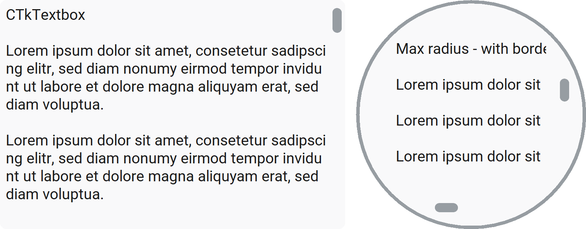

CTkTextbox
==========

The ``CTkTextbox`` widget is a **multi-line** text editor.

Use it for notes, messages, source text, logs, or any other content that may span multiple lines.
It supports vertical and horizontal scrolling, with horizontal scrolling available when ``wrap="none"``.

For a single-line input field, use :doc:`/widgets/CTkEntry` instead.
For read-only information, use :doc:`/widgets/CTkLabel`.

Example Code
------------

.. code:: python

   textbox = ctk.CTkTextbox(app, wrap="none")

.. code:: python

   # insert at line 0 character 0
   textbox.insert("0.0", "new text to insert")

   # get text from line 0 character 0 till the end
   text = textbox.get("0.0", "end")

   # delete text from line 0 character 0 till the end
   textbox.delete("0.0", "end")

.. py:class:: CTkTextbox
   :hidden:

   Arguments
   ---------

   Positional
   ~~~~~~~~~~

   .. include:: /arguments/master.rst
   .. include:: /arguments/theme_key.rst

   Functionality
   ~~~~~~~~~~~~~

   .. include:: /arguments/state.rst

   .. py:attribute:: xscrollincrement
      :type: int
      :value: 5

      Number of characters by which the visible text is moved every time the user scrolls on the widget horizontally.

   .. py:attribute:: yscrollincrement
      :type: int
      :value: 3

      Number of lines by which the visible text is moved every time the user scrolls on the widget vertically.

   Themed
   ~~~~~~

   .. include:: /arguments/widtheight.rst
   .. include:: /arguments/corner_radius.rst
   .. include:: /arguments/border_width.rst
   .. include:: /arguments/border_spacing.rst
   .. include:: /arguments/bg_color.rst
   .. include:: /arguments/fg_color.rst
   .. include:: /arguments/border_color.rst
   .. include:: /arguments/text_color.rst
   .. include:: /arguments/font.rst
   .. include:: /arguments/show_scrollbars.rst
   .. include:: /arguments/scrollbar.rst

   Inherited
   ~~~~~~~~~

   .. py:attribute:: undo
      :type: bool
   .. py:attribute:: autoseparators
      :type: bool
   .. py:attribute:: maxundo
      :type: int
   .. py:attribute:: wrap
      :type: 'none' | 'char' | 'word'
   .. py:attribute:: cursor
      :type: str
   .. py:attribute:: insertofftime
      :type: int
   .. py:attribute:: insertontime
      :type: int
   .. py:attribute:: insertborderwidth
      :type: float | str
   .. py:attribute:: insertwidth
      :type: float | str
   .. py:attribute:: selectbackground
      :type: str
   .. py:attribute:: selectforeground
      :type: str
   .. py:attribute:: selectborderwidth
      :type: float | str
   .. py:attribute:: spacing1
      :type: float | str
   .. py:attribute:: spacing2
      :type: float | str
   .. py:attribute:: spacing3
      :type: float | str
   .. py:attribute:: tabs
      :type: float | str | tuple[float | str, ...]
   .. py:attribute:: exportselection
      :type: bool
   .. py:attribute:: takefocus
      :type: bool
   .. py:attribute:: xscrollcommand
      :type: str | ((float, float) -> None)
   .. py:attribute:: yscrollcommand
      :type: str | ((float, float) -> None)

      Inherited attributes from :py:class:`tkinter.Text` widget.

      Check out the :tkdoc:`Tkinter documentation <text>` for their explanation.

      .. warning::
         ``xscrollcommand`` and ``yscrollcommand`` can be provided only using :py:meth:`configure()`.

   Class attributes
   ~~~~~~~~~~~~~~~~

   |class_attributes_description|

   .. include:: /arguments/scrollbar_update_time.rst

   Methods
   -------

   Inherited
   ~~~~~~~~~

   .. include:: /methods/tktext.rst
   .. include:: /methods/widget.rst
   .. include:: /methods/geometry_manager.rst
