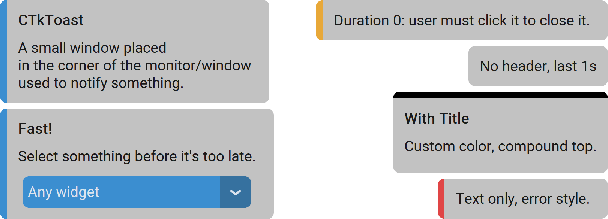

CTkToast
========

The ``CTkToast`` widget displays a short, temporary notification above the application content.

Use it to confirm a completed action, report a lightweight status update,
or provide non-blocking feedback without interrupting the current workflow.

It contains up to two :doc:`CTkLabels </widgets/CTkLabel>`, one for the **bold** title
and one for a detailed description.
However, this widget is ultimately a :doc:`/containers/CTkFloatingFrame`,
so you can place any widget on it by using it as ``master``.

To force the user to acknowledge the problem or request how to proceed,
use one of the basic :doc:`/utilities/Dialogs`.
For persistent information, use :doc:`/widgets/CTkLabel` or a dedicated
status area instead.

Example Code
------------

.. tab-set::

   .. tab-item:: Screen anchored

      .. code:: python

         def callback() -> None:
             print("toast pressed")

         toast = ctk.CTkToast(title="Title",
                              text="Message",
                              style="success",
                              close_on_interaction=True,
                              duration=5000,
                              command=callback)
         ...
         toast.show()

   .. tab-item:: App anchored

      .. code:: python

         def callback() -> None:
             print("toast pressed")

         toast = ctk.CTkToast(master=app,
                              title="Title",
                              text="Message",
                              style="warning",
                              close_on_interaction=False,
                              duration=2000,
                              command=callback)
         ...
         toast.show()

   .. tab-item:: With any widget

      .. code:: python

         toast = ctk.CTkToast(title="Fast!",
                              text="Select something before it's too late.",
                              close_on_interaction=False)

         optionmenu = ctk.CTkOptionMenu(toast,
                                        values=["option 1", "option 2", "option 3"],
                                        command=lambda _: toast.close())
         optionmenu.grid(row=2, column=0, sticky="ew", padx=20, pady=(0, 10))
         ...
         toast.show()

.. py:class:: CTkToast
   :hidden:

   Arguments
   ---------

   Positional
   ~~~~~~~~~~

   .. py:attribute:: master
      :type: CTkWidget | None

      Any widget to be used as a reference for positioning the widget.

      If omitted or set to ``None``, the monitor coordinates will be used instead.

   .. include:: /arguments/theme_key.rst

   Functionality
   ~~~~~~~~~~~~~

   .. py:attribute:: style
      :type: 'info' | 'success' | 'warning' | 'error'
      :value: 'info'

      If :py:attr:`fg_color_header` is ``None``, an appropriate color is used based on the provided style:

      - ``"info"``: blue
      - ``"success"``: green
      - ``"warning"``: orange
      - ``"error"``: red

      .. hint::
         You can change them or add new ones thanks to :py:attr:`style_colors`.

   .. py:attribute:: close_on_interaction
      :type: bool
      :value: True

      Specifies whether the widget gets closed as soon as the user interacts with it (e.g., by clicking it),
      or only after the :py:attr:`duration` has elapsed.

   .. py:attribute:: pre_command
      :type: (() -> ('break' | None)) | None
      :value: None

      Function that is invoked when the user clicks on the widget,
      but **before** the widget is actually closed (if requested by :py:attr:`close_on_interaction`).

      If the function returns exactly ``"break"``, the operation is not performed
      and :py:attr:`command` is not invoked at all.

   .. py:attribute:: command
      :type: (() -> None) | None
      :value: None

      Function that is invoked when the user clicks on the widget,
      but **after** the widget has been closed (if requested by :py:attr:`close_on_interaction`).

      If the function specified by :py:attr:`pre_command` returned ``"break"``,
      this function is not invoked.

   .. include:: /arguments/titletext.rst

   Themed
   ~~~~~~

   .. include:: /arguments/widtheight_container.rst
   .. include:: /arguments/corner_radius.rst
   .. include:: /arguments/border_width.rst
   .. include:: /arguments/border_spacing.rst

   .. py:attribute:: internal_spacing
      :type: int

      Space in |unscaled pixels| between :py:attr:`title` and :py:attr:`text` labels.

   .. include:: /arguments/fg_color.rst

   .. py:attribute:: fg_color_header
      :type: str | tuple[str, str] | 'transparent' | None
      :value: None

      Color of the accent stripe.

      If set to ``None`` (the default), the color is determined by :py:attr:`style`.

      .. warning::
         The size of the accent strip is equal to :py:attr:`corner_radius`,
         so it must be greater than ``0`` for this argument to have an effect.

   .. include:: /arguments/border_color.rst
   .. include:: /arguments/transparency.rst

   .. py:attribute:: compound
      :type: 'left' | 'right' | 'top' | 'bottom'

      Specifies the colored accent stripe position relative to the labels.

   .. py:attribute:: anchor
      :type: 'ne' | 'se' | 'sw' | 'nw'

      It controls where the widget will be placed with respect to :py:attr:`master`.

      ``"ne"`` places it in the top-right corner, while
      ``"sw"`` places it in the bottom-left corner.

   .. include:: /arguments/xy_offset.rst

   .. py:attribute:: duration
      :type: int
      :value: 5000

      The widget will be automatically closed after this time elapses, expressed as milliseconds.

      .. hint::
         Set it to ``0`` to have no limit, so the widget is closed only when clicked or with :py:meth:`close()`.

   .. include:: /arguments/label.rst

   Class attributes
   ~~~~~~~~~~~~~~~~

   |class_attributes_description|

   .. py:attribute:: fade_out_duration
      :type: int

      Specifies how long the fade-out animation lasts, expressed in milliseconds.

      .. hint::
         Set it to ``0`` to disable the animation entirely.

   .. py:attribute:: update_time
      :type: int

      Refresh rate of the fade-out animation, expressed in milliseconds.

      .. hint::
         |update_time_hint|

   .. py:attribute:: style_colors
      :type: dict[str, str]

      Lookup table to select the proper :py:attr:`fg_color_header` based on :py:attr:`style`.

   Methods
   -------

   .. py:method:: show() -> None:

      Shows the widget or updates the position if already visible.

      The position depends on :py:attr:`master`, :py:attr:`anchor`,
      :py:attr:`x_offset`, and :py:attr:`y_offset`.

   .. py:method:: close([immediate]) -> None:

      Closes the widget (``immediate=True``) or starts the fading-out effect (``immediate=False``).

      It can be shown again using :py:meth:`show`.

      :param bool immediate:
         If ``True``, the widget closes immediately; otherwise, a fade-out effect begins.

   .. py:method:: invoke() -> None:

      Starts the closure of the widget with a fade-out effect
      if the :py:attr:`pre_command` doesn't return ``"break"``.

      It can be called to simulate the user who clicks on the widget.

   Inherited
   ~~~~~~~~~

   .. include:: /methods/floatingframe.rst
   .. include:: /methods/widget.rst
