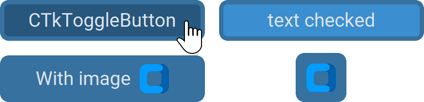

CTkToggleButton
===============

The ``CTkToggleButton`` widget is a button with a persistent selected or unselected state.

It has 2 internal states ("on" and "off"), to which you can assign
specific values thanks to :py:attr:`onvalue` or :py:attr:`offvalue`.

It is rendered as a :doc:`/widgets/CTkButton` that changes
:py:attr:`fg_color`, :py:attr:`hover_color`, :py:attr:`text`,
and/or :py:attr:`image` based on the internal state.
If you prefer a different rendering with the same functionality,
you can have a look at :doc:`/widgets/CTkCheckBox` or
:doc:`/widgets/CTkSwitch`.

Example Code
------------

.. tab-set::

   .. tab-item:: Text toggles

      .. code:: python

         def callback(new_value: str) -> None:
             print("button toggled, current value:", new_value)

         var = ctk.StringVar(value="on")
         togglebutton = ctk.CTkToggleButton(app,
                                            text_unchecked="option is off",
                                            text_checked="option is on",
                                            variable=var,
                                            onvalue="on",
                                            offvalue="off",
                                            command=callback)

   .. tab-item:: Image toggles

      .. code:: python

         def callback(new_value: bool) -> None:
             print("button toggled, current value:", new_value)

         togglebutton = ctk.CTkToggleButton(app,
                                            image_unchecked=("path_to_image", width, height),
                                            image_checked=("path_to_image", width, height),
                                            onvalue=True,
                                            offvalue=False,
                                            command=callback)
         togglebutton.select()

   .. tab-item:: Selectable image

      .. code:: python

         togglebutton = ctk.CTkToggleButton(app,
                                            text="",
                                            image=("path_to_image", width, height),
                                            fg_color_unchecked="transparent",
                                            corner_radius=1000,
                                            border_width=0,
                                            width=0,
                                            height=0)
         togglebutton.set(False)

.. py:class:: CTkToggleButton
   :hidden:

   .. _togglebutton_arguments:

   Arguments
   ---------

   Positional
   ~~~~~~~~~~

   .. include:: /arguments/master.rst
   .. include:: /arguments/theme_key.rst

   Functionality
   ~~~~~~~~~~~~~

   .. include:: /arguments/state.rst
   .. include:: /arguments/textvariable.rst
   .. include:: /arguments/toggleable.rst
   .. include:: /arguments/background_corner_colors.rst

   Themed
   ~~~~~~

   .. include:: /arguments/widtheight.rst
   .. include:: /arguments/corner_radius.rst
   .. include:: /arguments/border_width.rst
   .. include:: /arguments/border_spacing.rst

   .. py:attribute:: internal_spacing
      :type: int

      Space in |unscaled pixels| between label and image.

      .. note::
         If just the text or image is shown, this argument has no effect.

   .. include:: /arguments/bg_color.rst
   .. include:: /arguments/fg_color.rst

   .. py:attribute:: fg_color_checked
      :type: str | tuple[str, str] | 'transparent'

      Main color of the widget when the internal state is "on".

      Together with :py:attr:`fg_color_unchecked`,
      it replaces :py:attr:`fg_color` if at least one of them is different from ``"transparent"``.

   .. py:attribute:: fg_color_unchecked
      :type: str | tuple[str, str] | 'transparent'

      Main color of the widget when the internal state is "off".

      Together with :py:attr:`fg_color_checked`,
      it replaces :py:attr:`fg_color` if at least one of them is different from ``"transparent"``.

   .. include:: /arguments/border_color.rst
   .. include:: /arguments/text_color.rst
   .. include:: /arguments/text_color_disabled.rst
   .. include:: /arguments/text.rst

   .. py:attribute:: text_checked
      :type: str
      :value: ''

      Text to be displayed when the internal state is "on".

      Together with :py:attr:`text_unchecked`,
      it replaces :py:attr:`text` if at least one of them is different from ``""``.

   .. py:attribute:: text_unchecked
      :type: str
      :value: ''

      Text to be displayed when the internal state is "off".

      Together with :py:attr:`text_checked`,
      it replaces :py:attr:`text` if at least one of them is different from ``""``.

   .. include:: /arguments/font.rst
   .. include:: /arguments/anchor.rst
   .. include:: /arguments/justify.rst
   .. include:: /arguments/image.rst

   .. py:attribute:: image_checked
      :type: CTkImage | CTkImageArgs | tuple | str | None
      :value: None

      Image to be displayed when the internal state is "on".

      Together with :py:attr:`image_unchecked`,
      it replaces :py:attr:`image` if at least one of them is different from ``None``.

   .. py:attribute:: image_unchecked
      :type: CTkImage | CTkImageArgs | tuple | str | None
      :value: None

      Image to be displayed when the internal state is "off".

      Together with :py:attr:`image_checked`,
      it replaces :py:attr:`image` if at least one of them is different from ``None``.

   .. py:attribute:: compound
      :type: 'left' | 'right' | 'top' | 'bottom' | 'center'

      Specifies the image's position relative to the text label.

      .. note::
         If just the text or image is shown, this argument has no effect.

   .. include:: /arguments/wraplength.rst
   .. include:: /arguments/hover_color.rst

   .. py:attribute:: hover_color_checked
      :type: str | tuple[str, str] | 'transparent'

      Main color of the widget when the user hovers over it with the mouse and the internal state is "on".

      Together with :py:attr:`hover_color_unchecked`,
      it replaces :py:attr:`hover_color` if at least one of them is different from ``"transparent"``.

   .. py:attribute:: hover_color_unchecked
      :type: str | tuple[str, str] | 'transparent'

      Main color of the widget when the user hovers over it with the mouse and the internal state is "off".

      Together with :py:attr:`hover_color_checked`,
      it replaces :py:attr:`hover_color` if at least one of them is different from ``"transparent"``.

   .. include:: /arguments/hover.rst

   Methods
   -------

   .. include:: /methods/toggleable.rst

   Inherited
   ~~~~~~~~~

   .. include:: /methods/widget.rst
   .. include:: /methods/geometry_manager.rst
