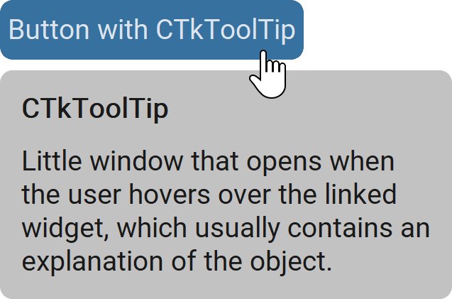

CTkToolTip
==========

The ``CTkToolTip`` widget shows a short explanation when the pointer hovers over the linked widget.

Use it to clarify an unfamiliar icon, explain a control without adding permanent text,
or provide concise contextual help.

It contains up to two :doc:`CTkLabels </widgets/CTkLabel>`, one for the **bold** title
and one for a detailed description.
However, this widget is ultimately a :doc:`/containers/CTkFloatingFrame`,
so you can place any widget on it by using it as ``master``.

Example Code
------------

.. tab-set::

   .. tab-item:: Fixed strings

      .. code:: python

         tooltip = ctk.CTkToolTip(any_widget,
                                  delay=500,
                                  title="Title",
                                  text=["Message", "on", "multiple", "lines"])

   .. tab-item:: Dynamic strings

      .. code:: python

         import datetime

         def create_title() -> str:
             return f"Today is {datetime.datetime.now().strftime('%d/%m/%Y')}"

         def create_text() -> str:
             return f"It's {datetime.datetime.now().strftime('%H:%M:%S.%f')}"

         tooltip = ctk.CTkToolTip(any_widget,
                                  mode="live_mouse",
                                  delay=0,
                                  title=create_title,
                                  text=create_text)

   .. tab-item:: Last modified for a path in an Entry

      .. code:: python

         import datetime
         from pathlib import Path

         entry = ctk.CTkEntry(app, placeholder_text="Write a file Path")

         def get_last_modified() -> str:
             retval = "Invalid File Path"

             path = Path(entry.get())
             if path.is_file():
                 timestamp = path.stat().st_mtime
                 time = datetime.datetime.fromtimestamp(timestamp)
                 retval = f"Last Modified: {time.strftime('%d/%m/%Y %H:%M')}"

             return retval

         tooltip = ctk.CTkToolTip(entry,
                                  mode = "mouse",
                                  delay = 200,
                                  text = get_last_modified)

.. py:class:: CTkToolTip
   :hidden:

   .. _tooltip_arguments:

   Arguments
   ---------

   Positional
   ~~~~~~~~~~

   .. py:attribute:: master
      :type: CTkWidget

      The widget that, when hovered over, will make this widget open.

   .. include:: /arguments/theme_key.rst

   Functionality
   ~~~~~~~~~~~~~

   .. py:attribute:: mode
      :type: 'master' | 'mouse' | 'live_mouse'
      :value: 'master'

      Changes the widget's position when it opens:

      - ``"master"``:
         It is placed relative to the position of :py:attr:`master` (the corner can be changed with :py:attr:`anchor`).
      - ``"mouse"``:
         It is placed where the mouse is at the time of opening.
      - ``"live_mouse"``:
         It follows the mouse position while it is moving over :py:attr:`master`.

   .. include:: /arguments/state.rst

   .. py:attribute:: close_on_interaction
      :type: bool
      :value: True

      Specifies whether the widget gets closed as soon as the user interacts with :py:attr:`master`
      (e.g., by clicking it) or only when the mouse moves outside of it.

   .. py:attribute:: pre_command
      :type: (() -> ('break' | None)) | None
      :value: None

      Function that is invoked when the user has hovered over :py:attr:`master` for :py:attr:`delay`,
      but **before** the widget is actually shown.

      If the function returns exactly ``"break"``, the operation is not performed
      and :py:attr:`command` is not invoked at all.

   .. py:attribute:: command
      :type: (() -> None) | None
      :value: None

      Function that is invoked when the user has hovered over :py:attr:`master` for :py:attr:`delay`,
      but **after** the widget has been opened.

      If the function specified by :py:attr:`pre_command` returned ``"break"``,
      this function is not invoked.

   .. include:: /arguments/titletext.rst

   Themed
   ~~~~~~

   .. include:: /arguments/widtheight_container.rst
   .. include:: /arguments/corner_radius.rst
   .. include:: /arguments/border_width.rst
   .. include:: /arguments/border_spacing.rst

   .. py:attribute:: internal_spacing
      :type: int

      Space in |unscaled pixels| between :py:attr:`title` and :py:attr:`text` labels.

   .. include:: /arguments/fg_color.rst
   .. include:: /arguments/border_color.rst
   .. include:: /arguments/transparency.rst

   .. py:attribute:: anchor
      :type: 'n' | 'ne' | 'e' | 'se' | 's' | 'sw' | 'w' | 'nw'

      If :py:attr:`mode` is ``"master"``, it controls the :py:attr:`master` corner at which this widget will be placed.

      Otherwise, it controls which corner of this widget will be placed at the mouse coordinates.

      .. warning::
         ``"center"`` is not allowed.

   .. include:: /arguments/xy_offset.rst

   .. py:attribute:: delay
      :type: int
      :value: 500

      The widget will be automatically opened after the mouse has remained
      on :py:attr:`master` for this amount of time, expressed in milliseconds.

      .. hint::
         Set it to ``-1`` to disable the automatic opening:
         you can still do it programmatically with :py:meth:`show()`.

   .. include:: /arguments/label.rst

   Methods
   -------

   .. py:method:: show() -> None:

      Shows the widget or updates the position
      if the :py:attr:`pre_command` doesn't return ``"break"``.

      The position depends on :py:attr:`mode`, :py:attr:`anchor`,
      :py:attr:`x_offset`, and :py:attr:`y_offset`.

   .. py:method:: close() -> None:

      Hides the widget.

      It can be shown again using :py:meth:`show()`
      or automatically based on :py:attr:`delay`.

   Inherited
   ~~~~~~~~~

   .. include:: /methods/floatingframe.rst
   .. include:: /methods/widget.rst
